Now that our Check Point appliance is up, let's get to work on setting it up for simple access for internal devices.

## Download and install SmartConsole

First thing, you have to download and install the Check Point SmartConsole, which is the thick client that allows you to manage your Check Point products. Remember that you need a Microsoft Windows operating system to use the SmartConsole.

From the web interface go to "Maintenance" --> "Download SmartConsole". Then click on the "Download Button".

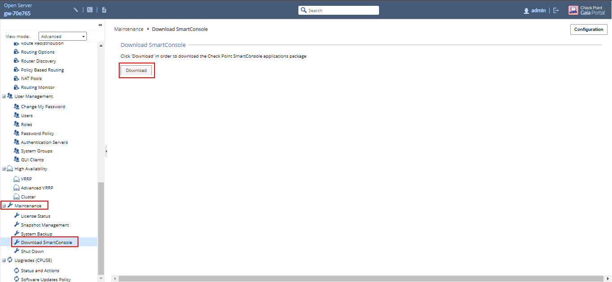

Once you have downloaded and successfully installed, launch the SmartConsole. 

Enter your username ("admin" if you used the default user) and the password you specified. Enter the Check Point management IP address then click "Login".

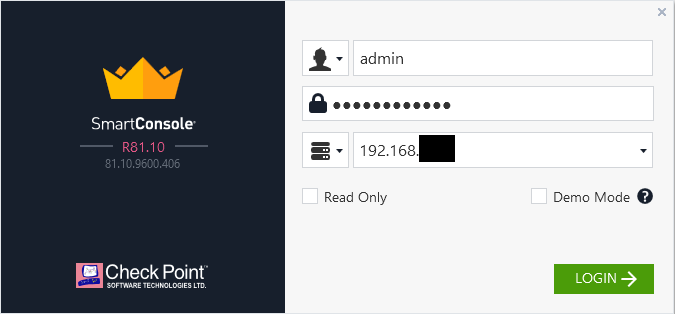

The first time you're logging in you will get a "Fingerprint" prompt to confirm that you're connecting to the correct server, and not some rouge one somewhere.

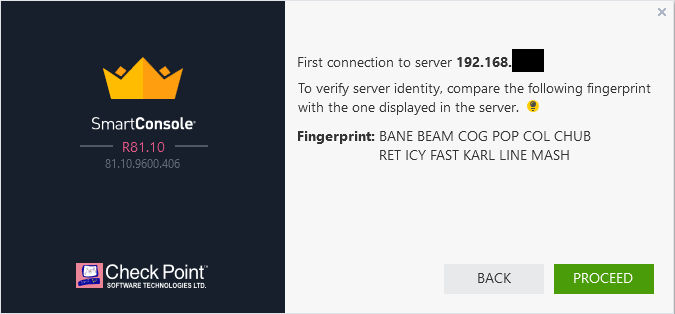

You can confirm the fingerprint by going to the web interface of the management server and doing a search for "fingerprint", or go to "System Management" --> "Certificate Authority".

Compare the fingerprint on the page, to the fingerprint in the SmartConsole. Then click proceed if it matches. Otherwise, you have some investigating to do.

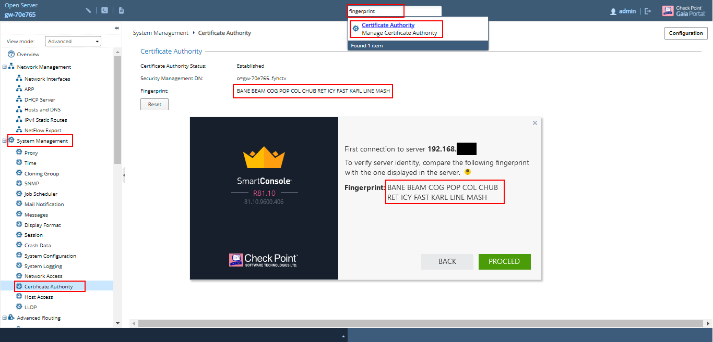

## Getting familiar with SmartConsole

Now that SmartConsole is installed and connected to the firewall, let's check out some basic features that you'll use regularly.

In the first pane you have an overview of all the gateways and servers in your Check Point estate. In this case I have only one, but if you have several enforcement points, logging servers and a management server, you will find them all here. 

At the right you'll see all the objects that are available to view and configure. You'll see some later down, but I'll go more into these in a later post.

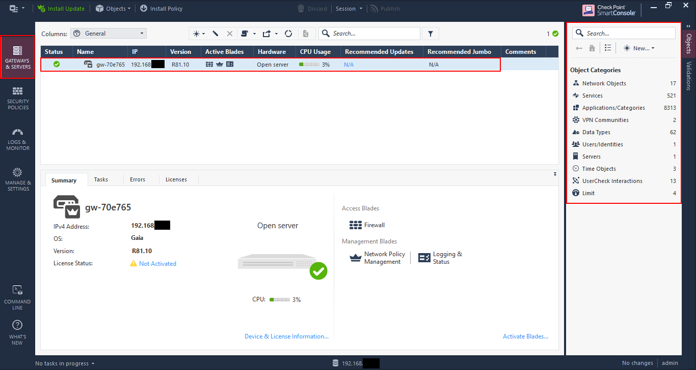

In the "Security Policies" section you configure the security features such as rules, network address translation (NAT) and inspection policies. 

Selecting "Policy" under "Access Control" shows you the rule base. For a clean install, only one rule is present, which is the "Cleanup Rule". This is an explicit "deny all" rule. While many firewalls allow all traffic - or web only traffic - by default, Check Point will have none of that. You need to explicitly allow your traffic. 

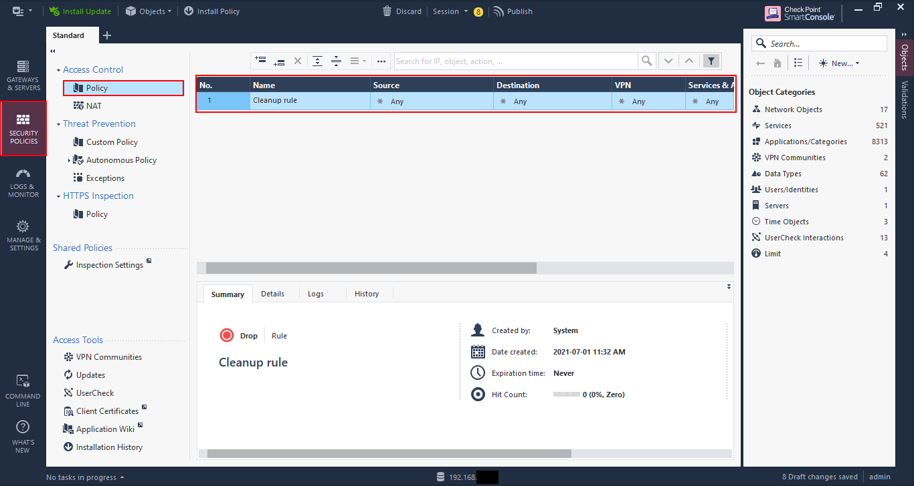

Select "NAT" to view the network address translation rules. There are only a couple automatic rules right now. We'll go through NAT and configuring NAT rules at another time. 

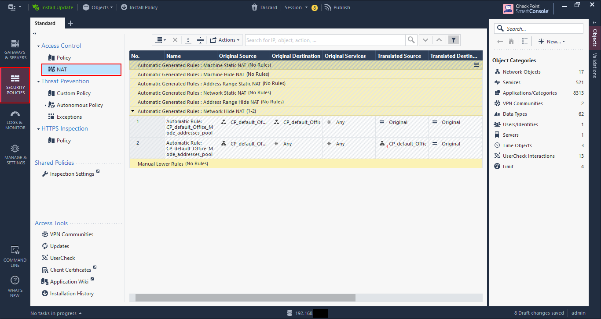

Go to the "Logs and Monitor" section to access the log viewer. Check Point has, in my opinion, the best log viewer of any firewall that I've used. The log viewer has remained largely unchanged over the past twenty years and has always remained highly usable. This is an area we'll explore another time as well.

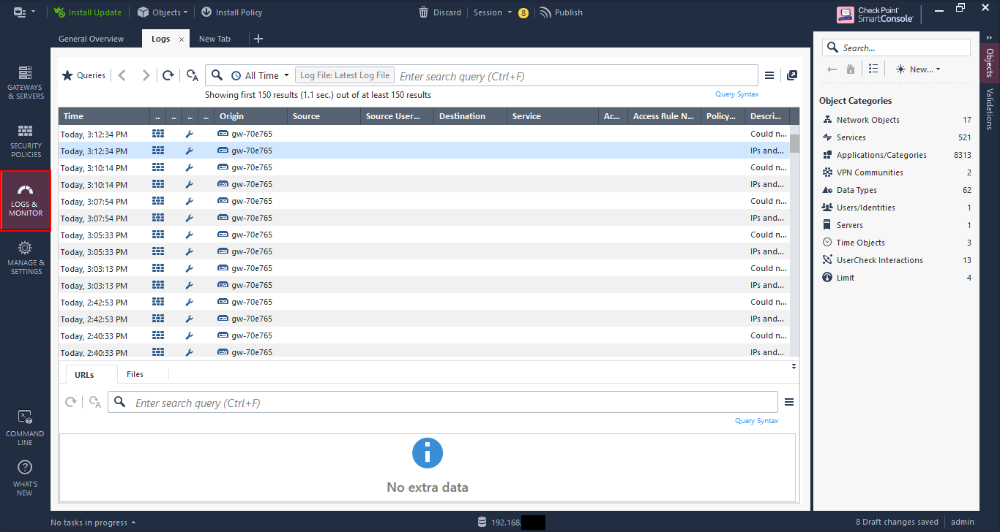

The "Manage & Settings" section allows you to configure the administrative management settings. 

Go to "Permissions and Administrators" --> "Administrators". Here you can add/delete/modify administrators for the Check Point management console. This is for Check Point management and not for the web interface, which is done via the Gaia web management. 

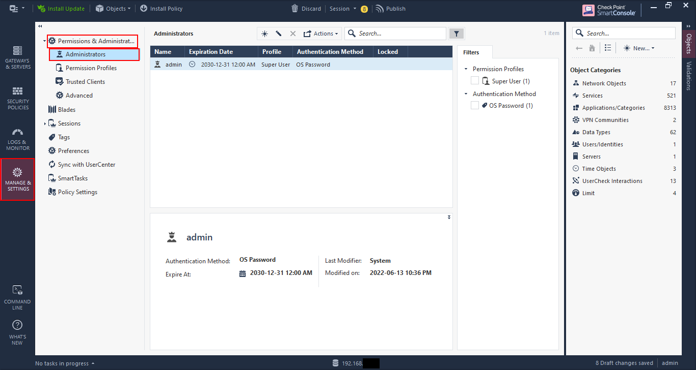

Go to "Trusted Clients" and you can limit the clients that can connect to the Check Point management by adding them here and removing "AnyHost". 

Go to "Sessions" --> "View Sessions" and you can see the sessions that are connected to the management console at the moment. It's only my connection here, but Check Point has added the capability for multiple persons to edit the rulebase at a time; this was previously not possible and was a pleasant surprise for me when I first upgraded to R80. 

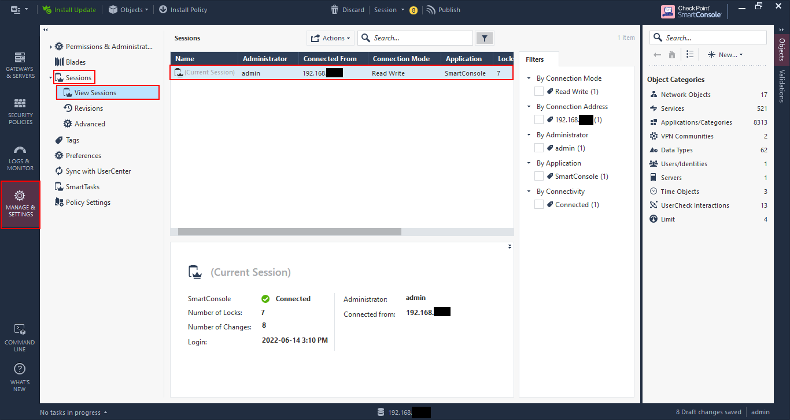

You can see the revisions made on the rulebase by going to "Revisions". This is useful as your rulebase becomes more complicated and you have multiple administrators. 

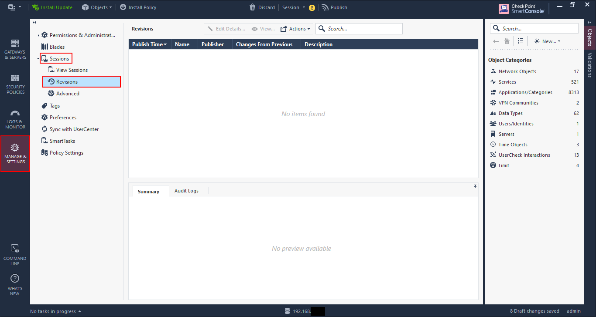

Enough of an overview, let's get to configuring some rules.

## Adding the networks to the gateway object

Before we start with the rules, we need to ensure that the gateway has access to all of the network interfaces available to it. 

Remember that the Check Point security gateway is an application on top of the operating system, which is Gaia (a hardened version of Linux). This is different to other firewalls such as Cisco ASA or Fortinet Fortigates where the OS and the firewall are one. So while the interfaces may have been configured in Gaia, we need to add them to the Check Point gateway.

Open the Check Point gateway object by double-clicking on it, or by selecting and clicking on the pencil icon above the list.

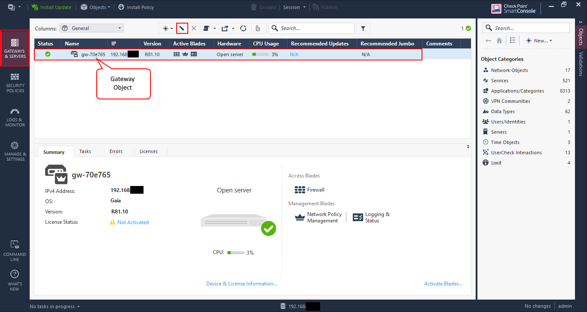

The "General Properties" shows an overview of the gateway and shows the features enabled for it. You can check other features to enable, but we won't get into that right now.

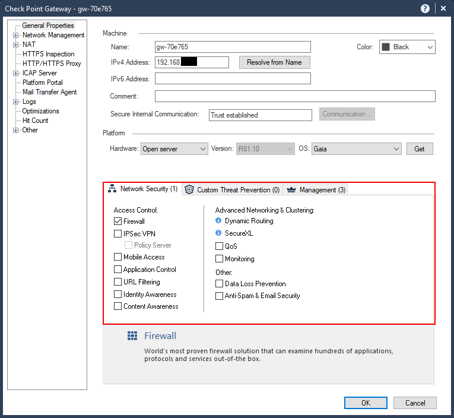

Go to "Network Management". Here you will see a list of the interfaces currently available. You will notice that the [DMZ interface that we configured](https://essgeelabs.com/posts/build-a-check-point-firewall-lab/#configure-additional-networks) is not showing in the list. Also the "Topology" is shown as "Undefined". Topology is how Check Point determines which networks are behind which interfaces so that it can do reverse-path and anti-spoofing checks.

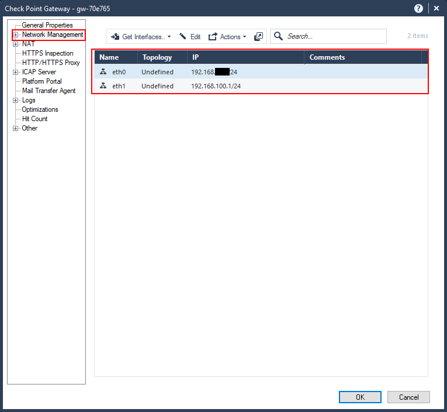

To add the other interfaces click on "Get Interfaces" --> "Get interfaces with Topology". This will get all the interfaces and any routing information as well. 

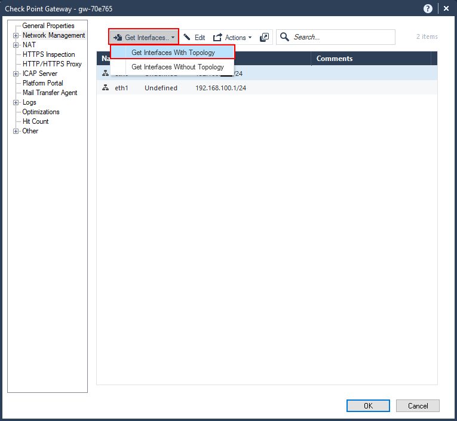

You'll get a little warning about getting the interfaces with topology. This is safe to do given that this is a new firewall; however, if you have an existing firewall and you've configured custom topologies and anti-spoofing settings, then it is best to not get the interfaces with topology and configure the topology manually. 

In this case, we shout "YOLO" and click "Yes".

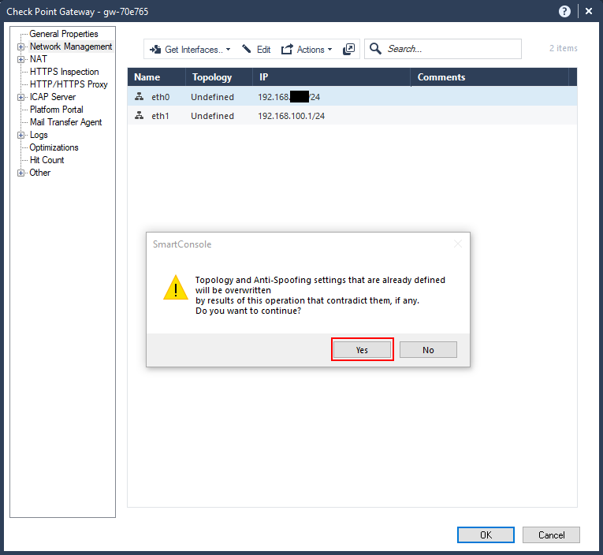

You get the results of the retrieval. Notice that the DMZ interface was retrieved as eth2, while the others are unchanged. 

Click "Accept". 

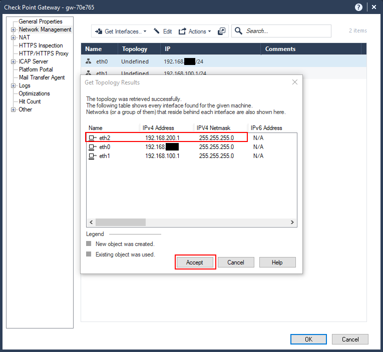

Now our networks have been defined, along with the topology. You'll notice that eth0 was defined as "External" in the topology; this is because the default gateway was specified for that network. 

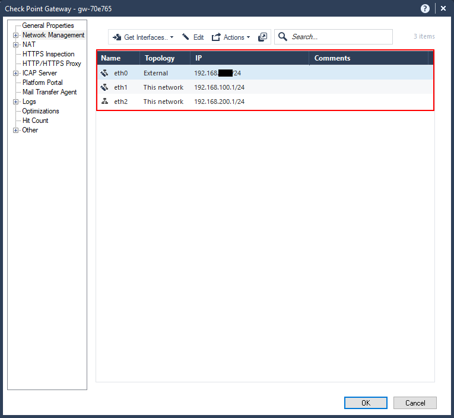

## Implied rules

Now that the networks have been defined let's look at creating access control policies, or rules.

Before we do that, there are some implied rules that exist. These are rules that are not explicitly defined in the rulebase, but exist in the firewall configuration. These are to allow access mainly for management and control protocols. 

You can view these implied rules by clicking on the three-dots, or ellipses, or kebab, above the rules and going to "Actions" --> "Implied Rules...".

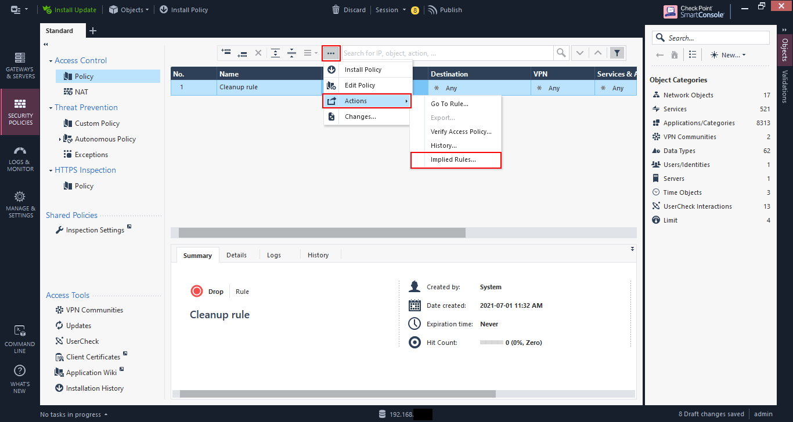

Here you can view the implied rules configured. 

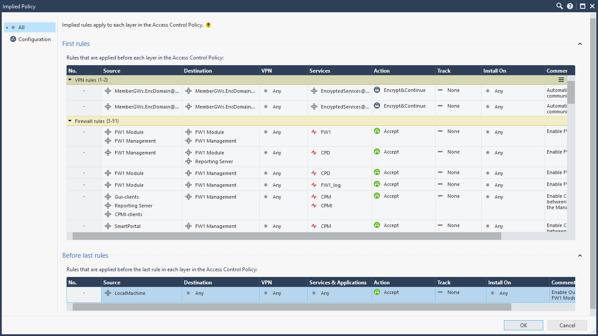

If you wish to change these implied rules, you go to the "Global Properties" in the main menu bar dropdown. 

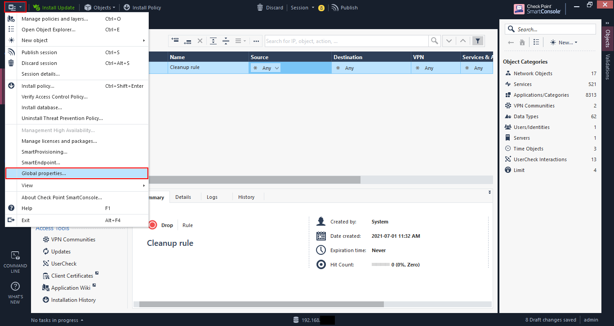

Here you can select which ones you wish to allow or deny, and where they can exist in the rulebase if available. I've only ever done this once for a customer, but for every other implementation I've kept the defaults. If you do decide to uncheck certain items, you need to explicitly configure the rules in the rulebase or you can lock yourself out. 

Notice that implied rules are not logged by default. 

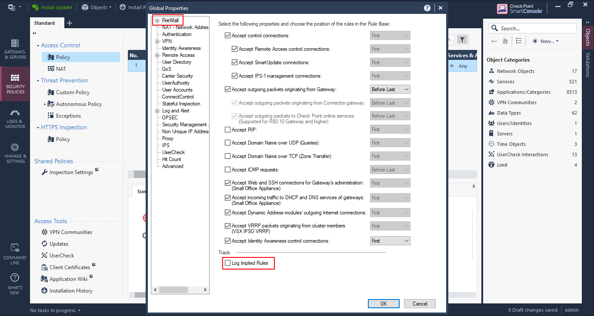

## Create your first rules

Let's create a rule. We'll create a rule to allow internal users to access all the services over the "Internet".

Right-click on a rule in the rulebase and select either "Above" or "Below" for "New Rule". Rules are evaluated from top-to-bottom order, so you need to place the rule above the "Cleanup rule".

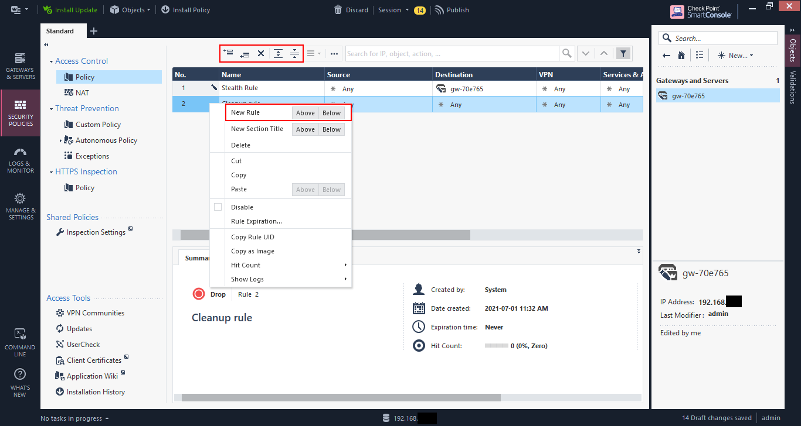

Astute readers would notice another rule defined that was not there before called the "Stealth Rule". I put that rule in but didn't capture it; sorry if that confused you. The stealth rule "hides" the firewall from anyone trying to connect directly to it, and is a best practice.

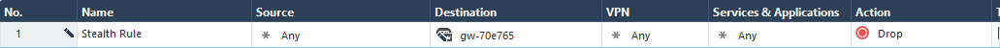

Specify the source by clicking on the plus sign, or add button, in the cell. A dialog showing all of the available network objects is displayed. Because the Internal network is not yet created, click on the star icon at the top, right-hand corner of the dialog box to add it. 

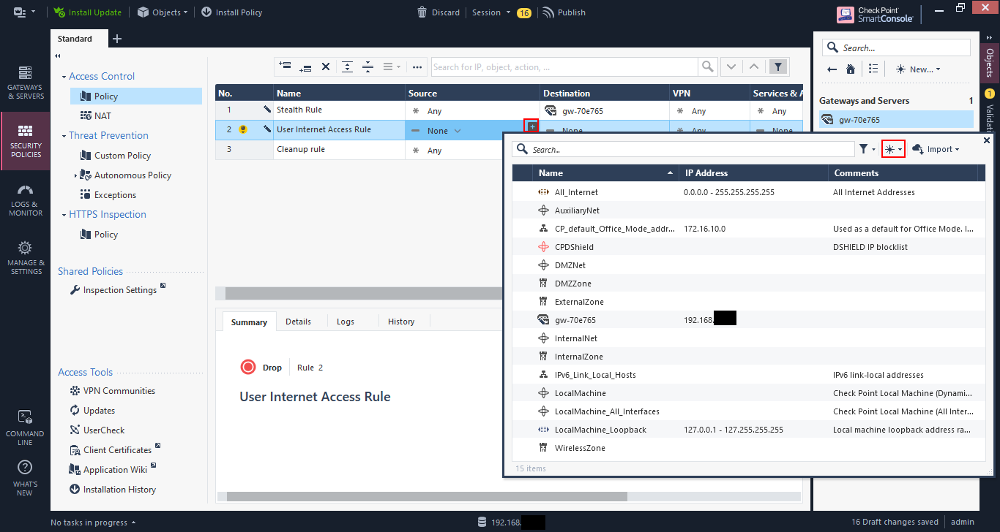

Specify the name of the object, the IP address and network mask. 

Optionally, you can change the colour of the object and add a tag, which is assist in administration, but doesn't change functionality.

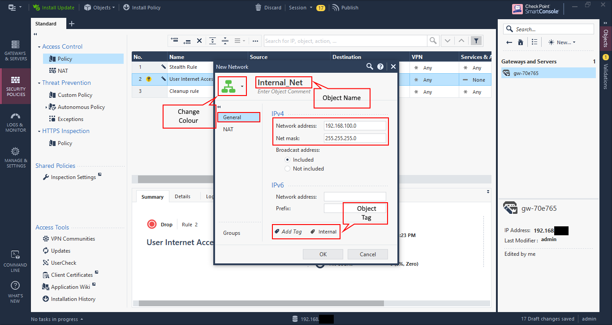

By default, Check Point does not enable NAT. Click on "NAT" and check the box "Add automatic address translation rules". 

Ensure that the "Translation method" is selected as "Hide", and "Hide behind the gateway" is selected. This means that all traffic coming from that network is "hidden" behind the destination interface of the firewall, in this case eth0's IP address. You can choose to hide behind another IP address in cases where you have others to use.

The other option of "Static" is for 1-to-1 NAT, and is not generally utilised for network objects. 

Click "OK" to save.

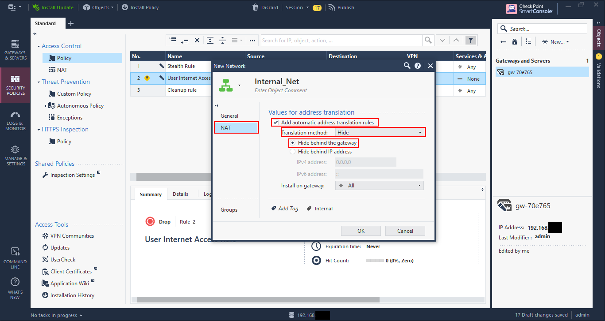

We'll set this rule to "any" destination. Click on the down arrow and select "Switch to 'Any'".

Repeat this for "Services & Applications" for now. This is the destination service.

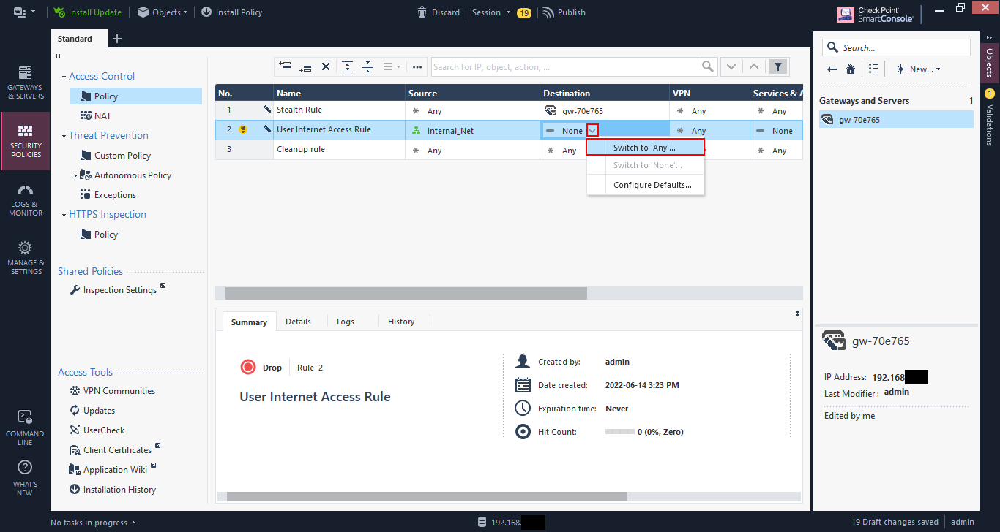

Rules are created as "Drop" by default. Click the down arrow and select "Accept" to allow the traffic.

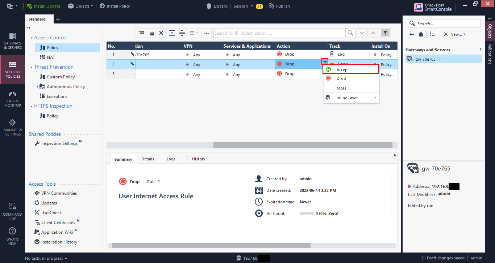

Rules by default are not logged. Click on the down arrow and select "Log" to log the traffic. 

The other option is "Alert" and allows for alerts to be sent, e.g. via email, when a rule is hit. This is useful for cases such as honeypots, so you can be alerted to possible malicious activities taking place.

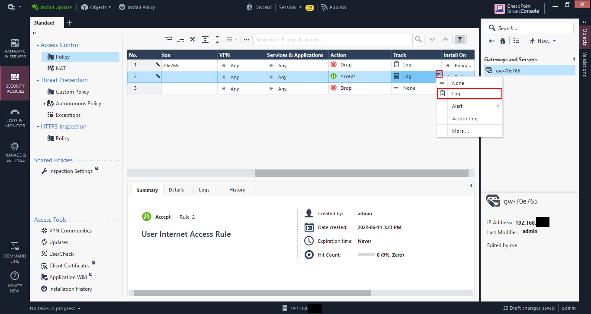

Let's create a rule to allow ICMP traffic (pings, traceroute, etc.) from both the Internal network and the DMZ to anywhere, including the firewall. This is just like the previous rule, but because we wish to be able to ping the firewall, we need to create it above the stealth rule. 

You will also need to create a network object for the DMZ network, which you should be able to using the Internal_Net example. 

But because we only want to allow ICMP, we need to specify the service. Click the plus, or add, button in the cell under "Services & Applications". Search for "icmp", then select "icmp-request" by clicking on the plus, or add, sign. Close the dialog box.

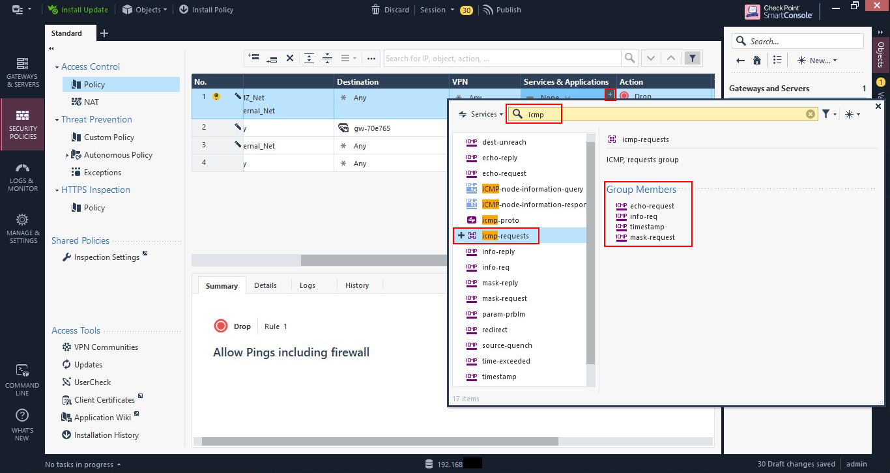

Let's change the rule for user internet access to allow just HTTP and HTTPS traffic. Go to the rule, and click on the plus, or add, sign in the cell under "Services & Applications" and search for "http". Then select "http" and "https" by clicking on the plus, or add, sign. Close the dialog.

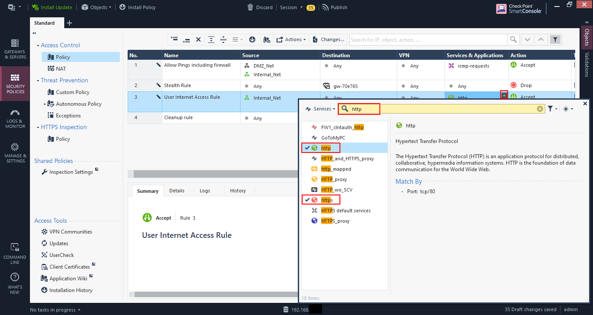

Now we have our initial rulebase to be installed.

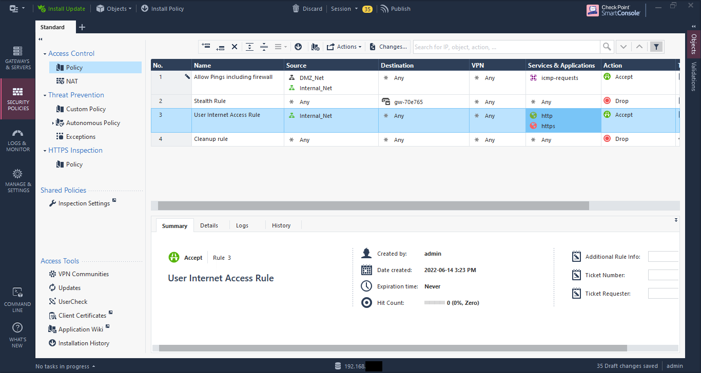

If you look at the top, you'll see some menu items. That number - 35 in this case - is the number of changes to be made. If you go through the previous screenshots, you'll see the number changing with each change. 

At this point we can discard all of the changes, or we can publish them. Publishing saves the changes, but doesn't push, or install, the policy on the firewall. This allows changes to be made during the day, and then pushed out during a maintenance window if anything. 

Click on "Publish" to publish your changes. You can change the name and add a description, which is highly recommended as it gives other administrators, and even you, an idea of what change was made and why. In my practice, I also add the ticket number assigned for the change to reference. 

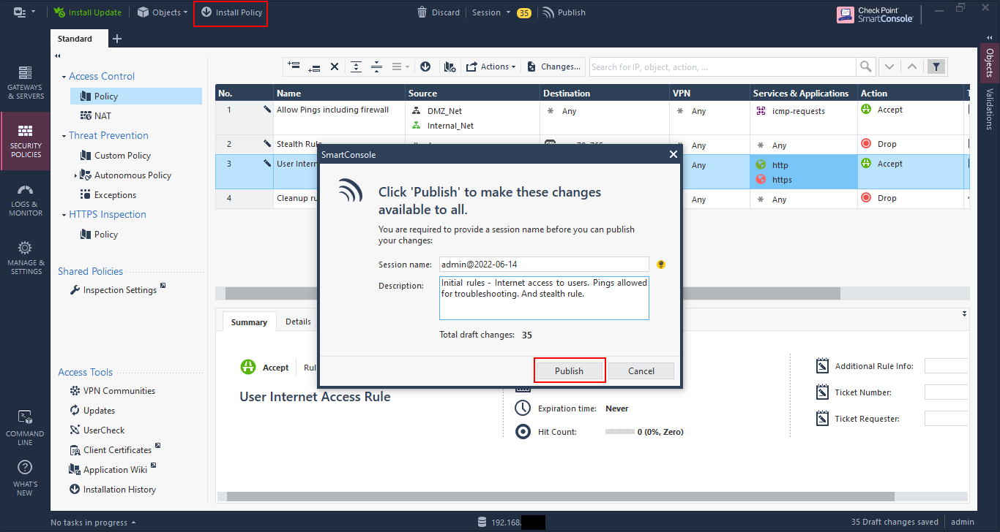

Once you've published the changes, you can go ahead and click on "Install Policy", which will push the policy to the firewalls. 

Note, you didn't have to publish first, and then install the policy. If you click on "Install Policy" without publishing, you will be asked to publish the changes before the installation will continue.

The "Install Policy" dialog is pretty standard in our case as there is only one firewall, but you can have multiple gateways to push to, including clusters.

Click "Install".

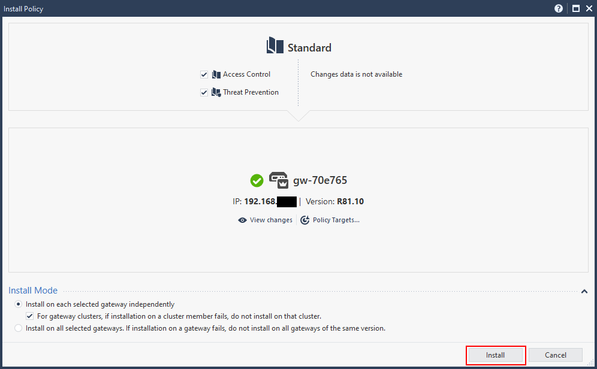

A progress indication is show at the bottom, left-hand corner. You can click on the bar to see more info. 

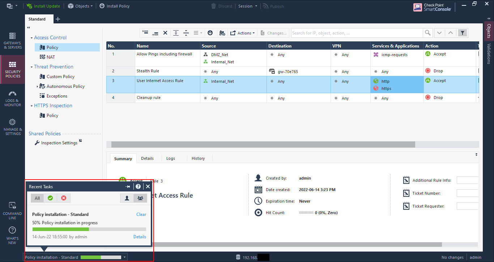

Install successful. If you see any red X's, you need to investigate. But for our simple setup here, this shouldn't happen. 

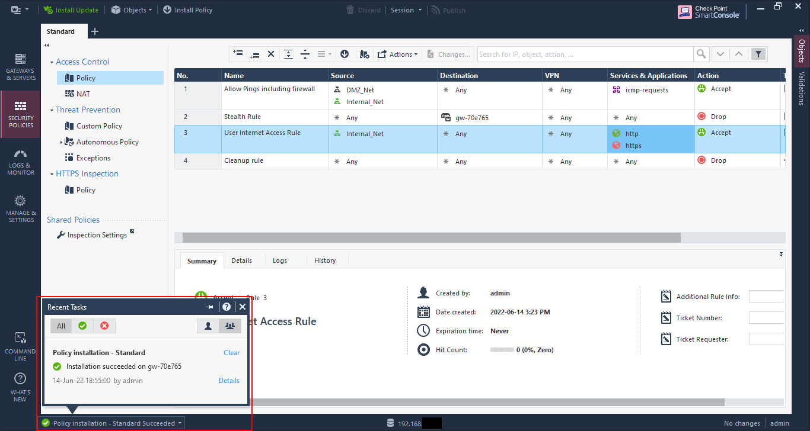

And there you go, you've created your first rule. You can go ahead and test access. If you're not getting through then you can check the logs for some help. My next Check Point post will go into more on the log viewer and on configuring NAT, once I get to it before this eval expires on me.
