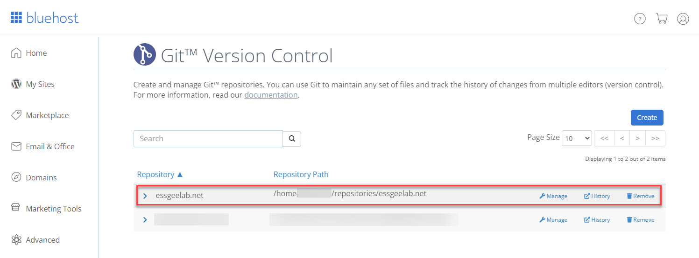

In getting this website up and running I wanted a way to simplify updating the site from the command line to open opportunities for automation. 

For this I wanted to be able to use Git to be able to mock up a website and then push the changes to the webhost once I was satisfied. So I was pleasantly surprised to find out that cPanel supports the use of Git repositories to do just that. 

cPanel is a web application that many web hosting providers use to allow customers to self-manage the backend of their websites. 

All my examples here is based on Bluehost, who I use as my webhost. I'm also using Windows 10 but the techniques will work with other OSes.

## To begin

This is not a newbie tutorial. You should be comfortable with the command-line and understand how web server and web hosting works.

You should have Git installed. You can download from [the Git website](https://git-scm.com/). 

You can use any web editing tool that you would like. Remember that this would be a static website as compared to a [dynamic website](https://www.geeksforgeeks.org/static-vs-dynamic-website/). I use [Visual Studio Code](https://code.visualstudio.com/download) for most of my editing needs.

You'll need SSH key pairs. [Generate them](https://www.ssh.com/academy/ssh/putty/windows/puttygen) if you don't already have one.

And of course you need a web host that use cPanel with Git Version Control and a domain attached. I'm using an addon domain, but this will work for the main domain as well.

## Add your SSH public key to the web host

Log into your web host and in cPanel go to Security, and click on SSH Access. (In Bluehost you have to go to Advanced first.)


Click on "Manage SSH Keys" 


Then click on "Import Key".


Specify a name for the key and paste in the *<u>public key only</u>*. Then click on "Import". Note that I can share my public key without fear of being compromised, which is the advantage of public-private key pairs.


You should see the new key in the "Public Keys" list. Click on "Manage" in the line with the key. 


Now click on "Authorize". You should get a message saying that they key has been authorised. 


When you go back to the Public Key list you should see the "Authorization Status" of the key as "authorized". 


## Create your Git Repository to cPanel

Back to cPanel, go to "Files" and "Git Version Control".


We'll be creating a new repository. Click "Create".


In the "Create Repository" window, disable the "Clone a Repository" toggle. This is only if you have an existing website hosted in another Git repository such as GitHub. We will be creating an empty repository.

Enter the repository path. I created a folder for my repositories, and you should do the same. This is not the folder that is used to store your web pages (usually the `~/public_html` or `~/www` folders). You'll see how to get the files in the correct location after.

Enter a name for the repository.

Then click on "Create". 


You should see a message that it was created successfully along with some instructions to add the repository to an existing project, or to clone the repository and build a new project. Copy and save these instructions.

Your repository should now be listed into your list of repositories.




## Edit the SSH config

Since the cPanel Git uses SSH to access the repository, you need to edit the SSH config file to point to your SSH private key file.

Go to your home folder. 

In Windows it'll be something like:

`C:\Users\<username>\`

In Linux it'll be:

`\home\<username>\` or just `~\`

You'll see a .ssh folder, if not, create it. Edit or create a text file named "config" with no extension (no .txt or anything).

Add the following to the file:

```
Host <domain name>
  HostKeyAlgorithms +ssh-rsa
  PubkeyAcceptedKeyTypes +ssh-rsa
  User <username to access web host>
  IdentityFile "<full path to private key e.g. c:\keys\private.key"
  Port 22
```

Save and close.

## Clone the Git repository to your local computer

Once you have Git installed, you can clone the repository to your local computer. In this example we're cloning and not using an existing copy of a web site. 

You can copy the Clone URL from the cPanel Git Version Control list.


Open a command or PowerShell prompt and navigate to the place where you would like to clone the repository.

```
PS C:\Users\sganpat\Website> git clone ssh://<username>@essgeelabs.net/home/essgeelab/repositories/essgeelab.net
Cloning into 'essgeelab.net'...
warning: You appear to have cloned an empty repository. 
cd essgeeglab.net
```

Create a Readme file to do an initial commit and push.

```
echo "# Readme" >> README.md
git add README.md
git commit -m "initial commit"
git push -u origin master
```

You should get output like:

```
Enumerating objects: 3, done.
Counting objects: 100% (3/3), done.
Writing objects: 100% (3/3), 216 bytes | 108.00 KiB/s, done.
Total 3 (delta 0), reused 0 (delta 0), pack-reused 0
remote: Recieved update on checked-out branch, queueing deployment.
remote: ---
remote: apiversion: 3
remote: func: create
remote: module: VersionControlDeployment
remote: result:
remote:   data: ~
remote:   errors: ~
remote:   messages: ~
remote:   metadata: {}
remote:
remote:   status: 1
remote:   warnings: ~
To ssh://essgeelabs.net/home/essgeelab/repositories/essgeelab.net
 \* [new branch]      master -> master
```

Great. All is setup to now push your website.

## Create a small web page and deploy

Create a simple static web page and associated files such as stylesheets and images and add them to the repository. For this example I'm using a simple page ([download](/downloads/cpanel-git-1/essgeelab.net.zip)).

```
PS C:\Users\sganpat\Website\essgeelab.net> git status
On branch master
Your branch is up to date with 'origin/master'.

Untracked files:
  (use "git add <file>..." to include in what will be committed)
        images/
        index.html
        style.css

nothing added to commit but untracked files present (use "git add" to track)

PS C:\Users\sganpat\Website\essgeelab.net> git add *

PS C:\Users\sganpat\Website\essgeelab.net> git commit -m "simple website"
[master 5498e9e] simple website
 4 files changed, 197 insertions(+)
 create mode 100644 images/egllogo.png
 create mode 100644 images/twitter.png
 create mode 100644 index.html
 create mode 100644 style.css

PS C:\Users\sganpat\Website\essgeelab.net> git push origin master
Enumerating objects: 8, done.
Counting objects: 100% (8/8), done.
Delta compression using up to 8 threads
Compressing objects: 100% (7/7), done.
Writing objects: 100% (7/7), 15.86 KiB | 3.96 MiB/s, done.
Total 7 (delta 0), reused 0 (delta 0), pack-reused 0
remote: Recieved update on checked-out branch, queueing deployment.
remote: ---
remote: apiversion: 3
remote: func: create
remote: module: VersionControlDeployment
remote: result:
remote:   data: ~
remote:   errors: ~
remote:   messages: ~
remote:   metadata: {}
remote:
remote:   status: 1
remote:   warnings: ~
To ssh://essgeelabs.net/home/essgeelab/repositories/essgeelab.net
   b295c0c..5498e9e  master -> master
```


Great, you've added the site to the repository. But when you browse to the URL it doesn't work. That's because it needs to be deployed. To do this, you need to create a text file called `.cpanel.yml` and add your deploy tasks in there. These are the bash commands you would run to deploy the site from the repository folder.

For instance, in my case it would be to copy the `index.html` and `style.css` files and the `images` folder to the root directory of the web server. So my `.cpanel.yml` file will look like:

```
---
deployment:
 tasks:
 - export DEPLOYPATH=/home/essgeelab/public_html/essgeelabs.net/
 - /bin/cp index.html $DEPLOYPATH
 - /bin/cp style.css $DEPLOYPATH
 - /bin/cp -R images $DEPLOYPATH
```

now commit that file and push to the remote respository.

```
git add .cpanel.yml
git commit -m "cpanel deploy file"
git push origin master
```

Now the website should be operational. 
