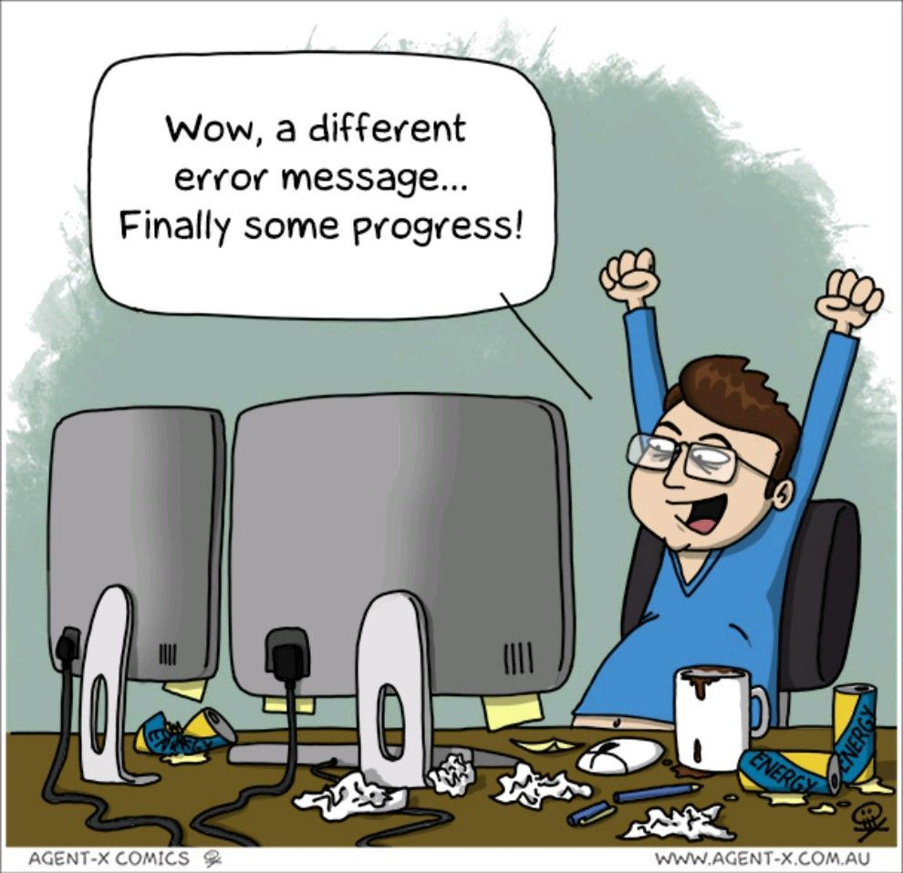

# First Post

This is a test of posting in Hugo. The aims of this test are:

* test how Hugo renders sites
* check the template operation
* learn to modify the operation

# End state

At the **end** of this, I want to be able to have a new static site created using Hugo.

# Tests

## Figure



## YouTube



## Twitter



## Image

