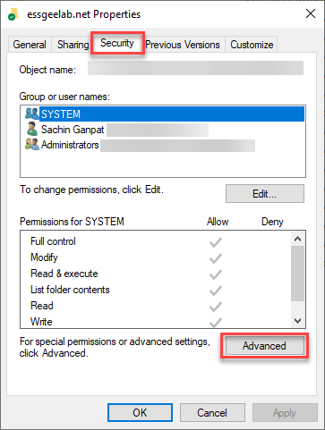
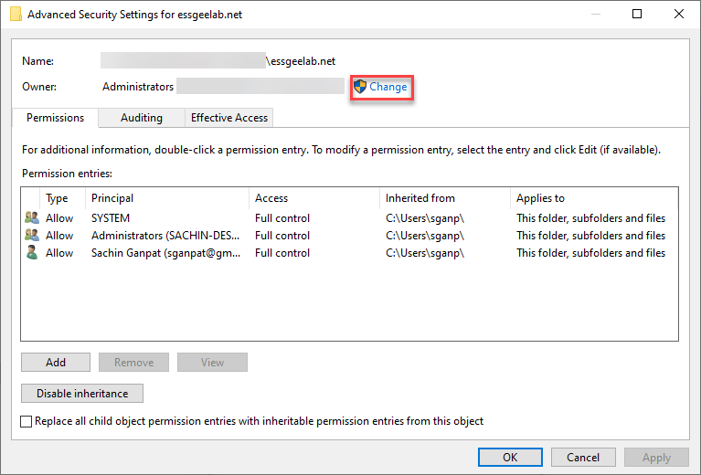
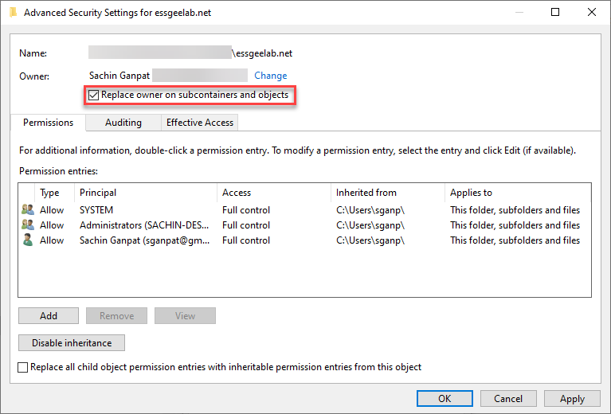

Yesterday I tried a `git status` on one of my repositories and got the error:

```
fatal: unsafe repository ('C:/Users/sganpat/Website/essgeelab.net' is owned by someone else)
To add an exception for this directory, call:

        git config --global --add safe.directory C:/Users/sganpat/Website/essgeelab.net
```

This is linked to the [fix for CVE-2022-24765 and CVE-2022-24767](https://github.blog/2022-04-12-git-security-vulnerability-announced/) and shows up after Git version 2.35.2.

One fix is to run the command:

```
git config --global --add safe.directory <directory of git repository>
```

However, in my case, I needed to update the owner of the folder.

Right-Click on the root folder of the repository in Windows Explorer and click on "Properties".

Select the "Security" tab and click on "Advanced".




At the "Owner" line, you should see someone other than yourself as the owner. Click on "Change".




Select yourself as the owner and click "Ok". Select "Replace owner on subcontainers and objects" and click "Ok" out of all the dialog boxes.




Now Git should be working fine again in your repository. Try doing a `git status`.

```
On branch main
Your branch is up to date with 'origin/main'.

nothing to commit, working tree clean
```

