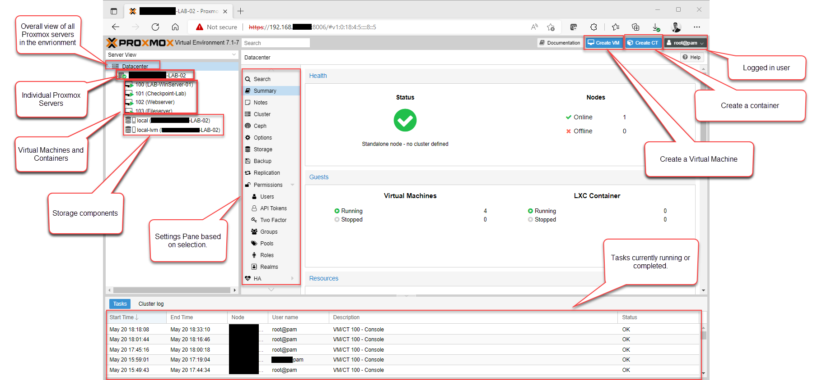
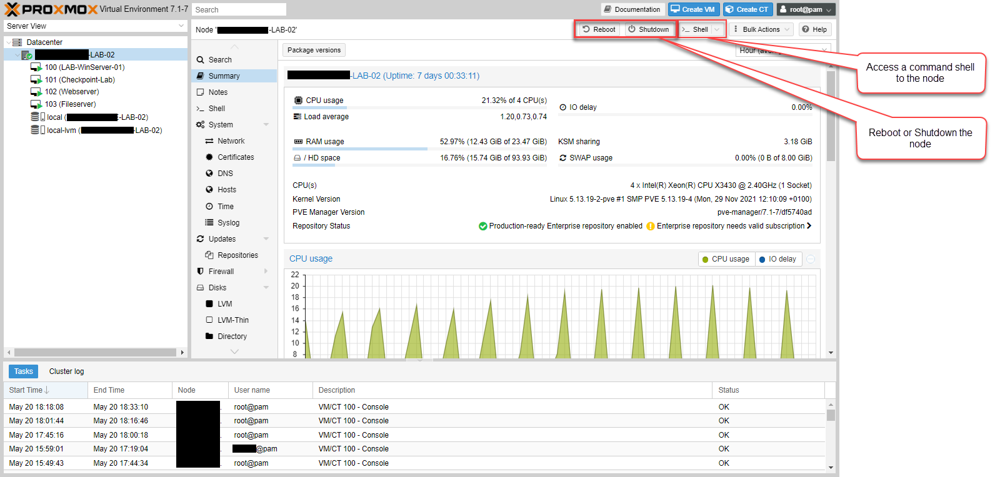
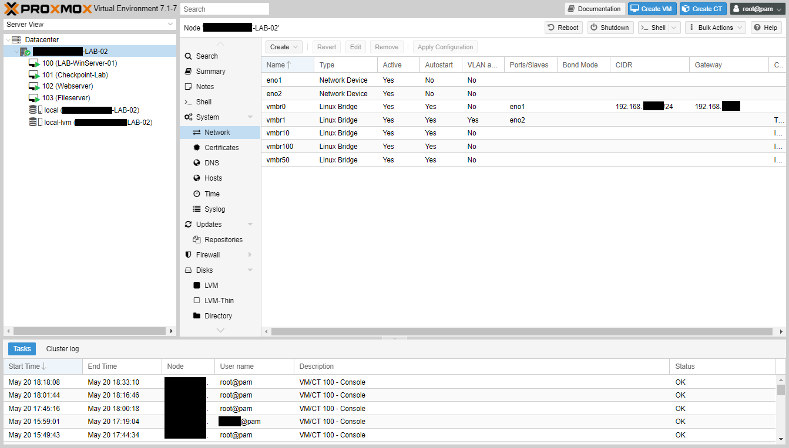
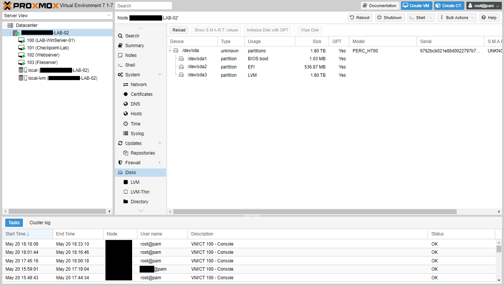
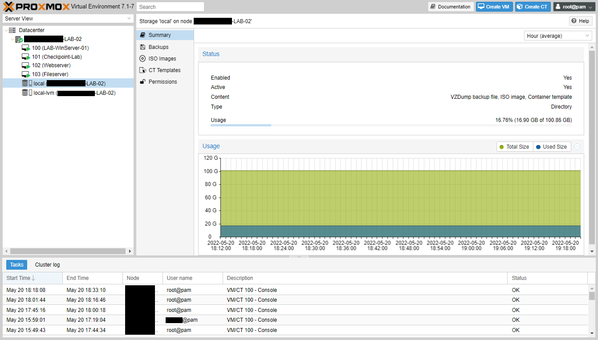
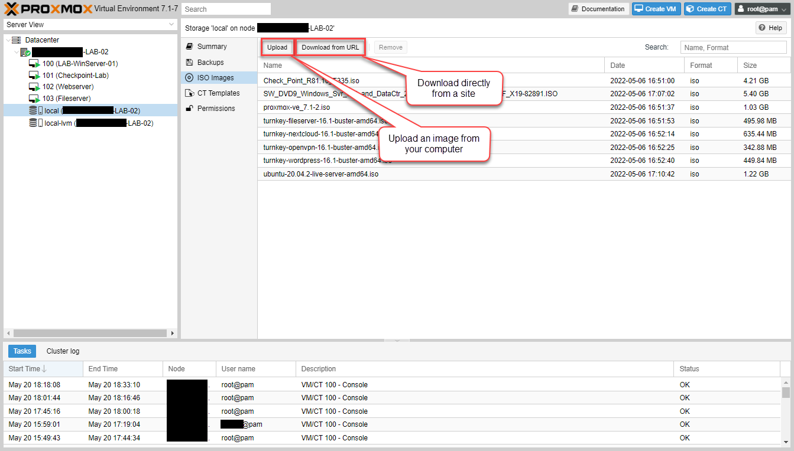
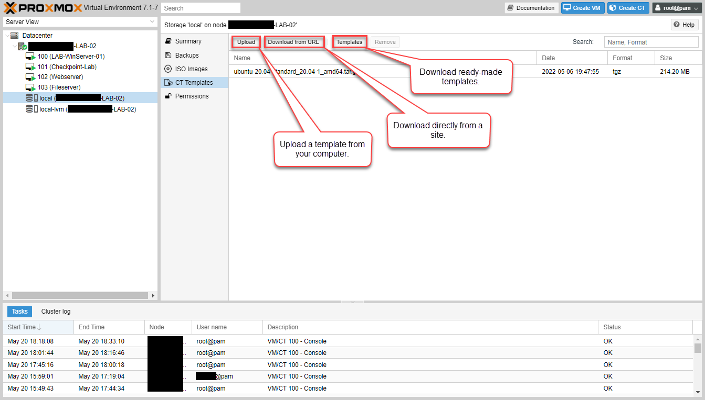
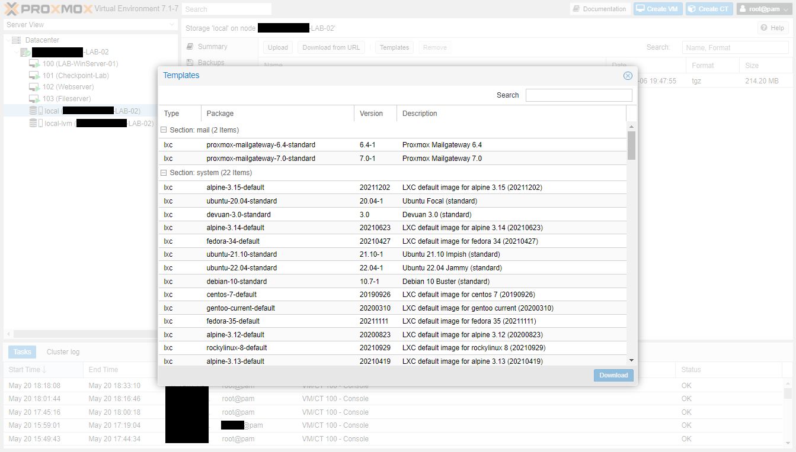
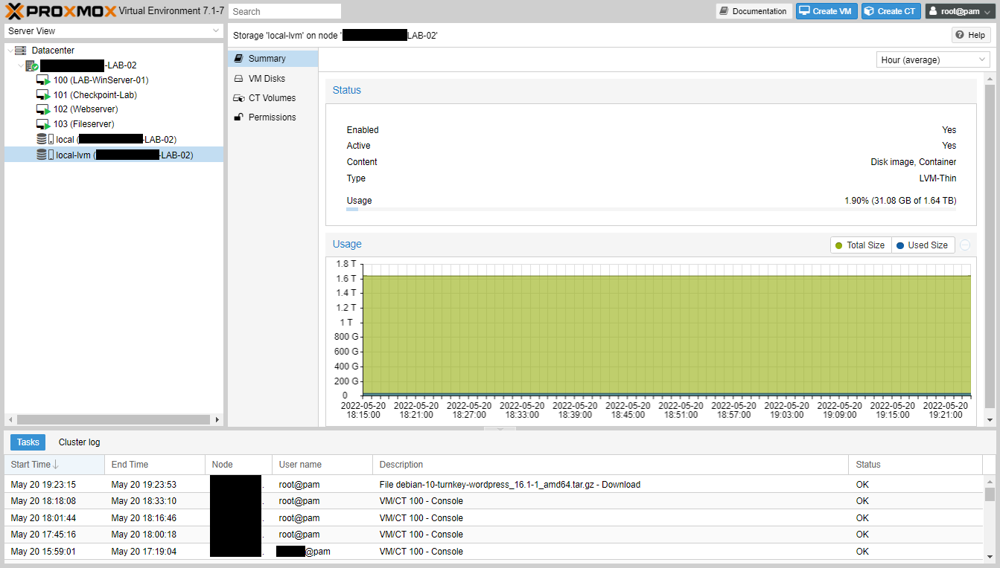
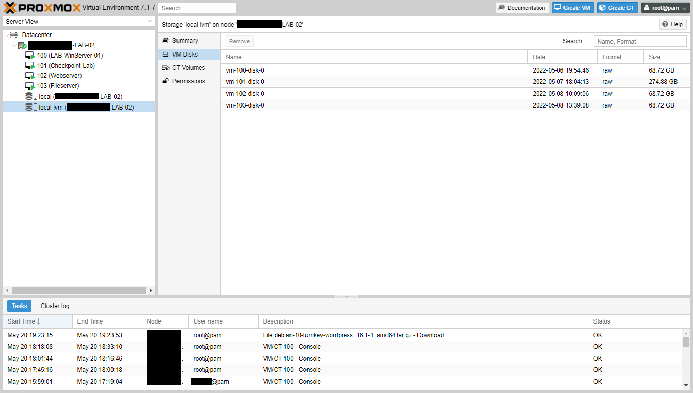

I have some new team members and need them to get up to speed with a few things. One of the best ways to get comfortable with technologies is to actually get some practical experience with it. So we needed to get a lab up and running.

In the past I built my labs using either VMWare Workstation on EXSi. However, I didn't have a license for Workstation, and I'm using some old, decommissioned server hardware for the lab, so I decided to try [Proxmox](https://www.proxmox.com/).

## What is Proxmox?

Proxmox is an open-source virtualisation platform based on KVM (Kernel-based Virtual Machine) and (LXC) Linux containers, and built on Debian Linux. 

But don't let its open-source nature fool you, this platform is chock-full of enterprise features such as:

* Web-based management interface
* High-availability (HA) clustering capabilities
* Software-defined storage
* Virtual networking
* REST API 
* And security features such as:
  * Role-based access controls
  * 2FA 
  * Firewall

And even though my hardware was old, it was able to run the latest version of Proxmox, as compared to ESXi, where I would be stuck at version 6.5.

## Required hardware for Proxmox

From the [System Requirements page](https://pve.proxmox.com/pve-docs/chapter-pve-installation.html), Proxmox requires at minimum:

- 64bit (Intel EMT64 or AMD64) CPU
- Intel VT/AMD-V capable CPU/Mainboard for KVM full virtualization support
- 1 GB RAM, plus additional RAM needed for guests
- Hard drive capacity to support the OS, installation images, and virtual machine drives. Proxmox doesn't recommend anything, but I suggest nothing less than 256GB.
- One network port (NIC), but I suggest two if you can - one for management, and the other for VM connectivity.

I used an old Dell T310 server with 24GB of RAM, and 3 x 600GB hard-disks in a single RAID 0 array for 1.8TB of capacity (it's a lab so I didn't care for redundancy).

## Downloading and installing Proxmox

To get started you will need a 2GB USB stick if you're using version 7.x. You could use a 1GB stick if you're using version 6.4, but you'll get more stability with version 7. 

[Download the Proxmox ISO image from the official site](https://www.proxmox.com/en/downloads/category/iso-images-pve).

Once you have the image downloaded you'll create the bootable USB drive. You can find the [installation instructions here](https://pve.proxmox.com/pve-docs/chapter-pve-installation.html). I use MS Windows so I used Rufus to create my bootable drive. 

I installed my setup using the default settings and standard LVM (Logical Volume Manager). You will need to have the server connected to the network so that you can access the web management interface. It doesn't need to be connected to the Internet, but it's recommended so that you can get updates.

## Getting familiar with the web management interface

Once the server is up and running you will get a screen telling you to connect to the web management interface on port 8006 via the URL:

`https://<ip address of host>:8006`

And log on with the root account and password that you created during the installation process.

Note: The screenshots in the examples are of my setup so you will see some machines have already been created. You will obviously not have any machines as yet.

### The main interface

This is the main dashboard where you can see an overall view of the status of the platform and access all the management components. I've highlighted the main areas for you to access. 

### Node view

If you click on a node (individual server) you'll see the dashboard change to show status information about the node. You will also be able to access settings specific to the node in the settings pane.

Here you can see overall stats about the CPU, memory and Hard Disk usage. Note that the HD usage is the system disk and not the space available for virtual machines.

### Network view

You can view all the network interfaces and all the virtual networks in this setting under the node. We'll discuss setting up virtual networks next time. For now, know that here you can specify the networks that virtual machines can either communicate with each other, or to the physical network.

### Disk view

You can view disks and partitions on the node in the disk view. You can perform some operations on the disks here as well. We'll probably explore some things here in later posts.

## Storage, images and templates
Selecting the storage components you can see the details about each storage element. Proxmox supports different types of storage and you can [read more about it on their wiki](https://pve.proxmox.com/wiki/Storage). When you install Proxmox on your server you should get two types - Directory and LVM-Thin.

### Directory storage
The directory storage type is a local directory that will store things like ISO images and container templates. 

### ISO Images

You can upload ISO images onto your node by selecting "ISO Images" in the settings pane. Here you can either upload ISO images to the node, or have it download it directly from a URL if it can access it.

### Container Templates

Containers are lightweight virtual instances that utilises the kernel of the host system instead of virtualising the entire hardware for a full operating system for a virtual machine. Containers use less resources than a full virtual machine, but it means that there are limitations on what can be run, for example, only Linux-based containers can work. 

There are many ready-made templates available for use already in Proxmox. Just select the one you want and click download.

### LVM-Thin Storage

LVM-Thin storage is a block storage format, but allows thin-provisioning of Virtual Instances. This means that instead of allocating storage for a virtual machine based on the volume of the disk, it allocates it only when it's written. This way if I have three VMs with 500GB disks, but each is using only 100GBs, I could put them on a 500GB LVM-Thin storage without issue, once the total usage within each of the VMs don't add up to greater than 500GB. 

This is something that you should monitor if you plan to use. Here you can see while I have four VMs with about 500GB of drive space allocated among them, only 31GB are actually consumed.

## Next steps

In my next post I will walk through the virtual networking setup so you can have your machines talk to each other, or to networks outside of the host. 
