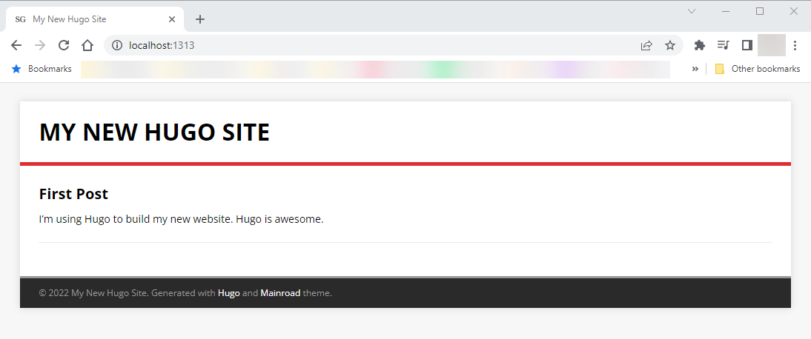
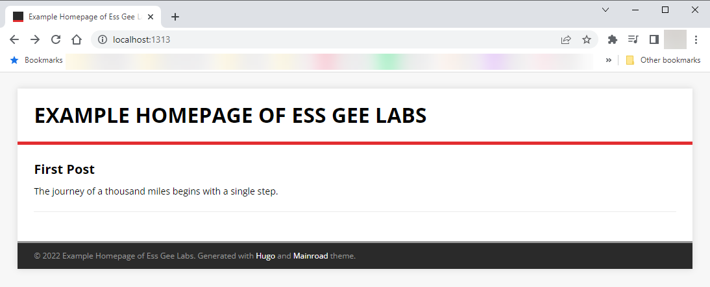
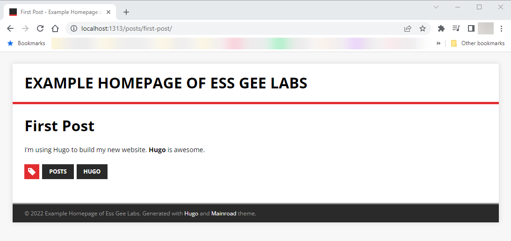

I mentioned in [my last post](https://essgeelabs.com/posts/cpanel-git-1/) about using cPanel Git Version Control to allow the deploying of a static website. I did that because I had started to look some time ago at static website generators. 

## The conception

For most of my online web-publishing life I've been using [WordPress](https://wordpress.org/). Before that, I used to create static web pages by writing HTML in a text editor (I can't remember which one) and hosted on the now defunct theglobe.com. 

I really like WordPress. It makes blogging easy and it's very well supported with tons of plugins and themes to choose from to customise the look at feel of your site. It was through WordPress that I really took up blogging and learning about CSS, PHP and MySQL. 

But WordPress was a pain to keep updating. And when it came to changing the theme, it was a chore. I would build a staging environment on my computer, but there was no way to transfer that exactly as is to the production site. I would copy the theme across, with images and plugins, then add back the widgets as needed. Sometimes a backup and restore would work, but that was not guaranteed. 

So I started to look for a different way, and that's how I found static website generators.

## Static Website Generators

Static Website Generators does just what its name implies - generates a static website. 

Static website generators uses templates to generate entire websites composes only of the HTML, CSS and JavaScript files. This means that sites can run faster, and more securely because there's no application running in the backend to render the pages. 

It also means that I could easily run an entire CI/CD pipeline for any type of changes to the website, whether it's adding posts, pages, or even changing the theme.

There are a quite a few static website generators out there such as:

* [Jekyll](https://jekyllrb.com/)
* [Gatsby](https://www.gatsbyjs.com/)
* [Pelican](https://blog.getpelican.com/)
* [Eleventy](https://www.11ty.dev/)

Each has their own set of advantages all written in their own language such as Ruby (Jekyll), JS (Eleventy, Gatsby) or Python (Pelican). 

I opted to go with [Hugo](https://gohugo.io/), which is a generator written in the Go programming language. Why? Hugo is fast, comes with its own set of binaries, very active community, and lots of themes to choose from. The last one is important because my front-end skill sucks. 

## To begin

This is not a newbie tutorial. You should be comfortable with the command-line and understand how web server and web hosting works.

Like my [last post](https://essgeelabs.com/posts/cpanel-git-1/), you should have Git installed, which you can download from [the Git website](https://git-scm.com/). 

You can use any web editing tool that you would like. I use [Visual Studio Code](https://code.visualstudio.com/download) for most of my editing needs.

And you need somewhere to host this. I use [BlueHost](https://www.bluehost.com/), but there are other options out there. I want to move this site later to [Netlify](https://www.netlify.com/) or a cloud host like my favourite, [Digital Ocean](https://m.do.co/c/70e2dbeee7fd).

## Installing Hugo

First thing to do is [install Hugo](https://gohugo.io/getting-started/installing/). The easiest way to do this on Windows is to use [Chocolatey](https://chocolatey.org/).

[Install Chocolatey](https://chocolatey.org/install#individual) and then, at the command or PowerShell prompt, install Hugo by running:

```
choco install hugo -confirm
```

If you want a nice GUI to manage your Chocolatey packages, install the Chocolatey GUI by running:

```
choco install chocolateygui
```

Then you can open the Chocolatey GUI from the Programs menu.

And that's it. Hugo is installed. You can check your Hugo version by typing:

```
hugo version
```

## Building your first Hugo site

At the command prompt, navigate to the location that you want to create your new site. This is not the location where you have the web files of your current website if you followed [my last tutorial](https://essgeelabs.com/posts/cpanel-git-1/), and must be a new location. 

Now type:

```
hugo new site <your new site name>
```

e.g. `hugo new site essgeelabs.net`

Now we're going to add a theme to it. A theme gives the site the look and feel. You could create that from scratch by creating the layout and asset files, but why do that to yourself. 

You can find Hugo themes by going to [themes.gohugo.io](https://themes.gohugo.io/). This site (at the time of writing) is using [PaperMod](https://themes.gohugo.io/themes/hugo-papermod/), but for this example I'm going to use [Mainroad](https://themes.gohugo.io/themes/mainroad/). 

Change directory to the folder created with your new site's name. Now we'll use Git to download the theme after first initialising Git.

```
cd essgeelabs.net
git init
git submodule add --depth=1 https://github.com/vimux/mainroad.git themes/mainroad
```

The last command initialises the theme as a submodule in the repository into the themes/mainroad directory. The parameter `depth=1` is not necessary, but it reduces the size of the repository by only downloading up to the last commit. 

Now add `theme = "mainroad"` to the config.toml file.

```
echo 'theme = "mainroad"' >> .\config.toml
```

The config.toml file holds configuration information for the site. The file can also be YAML or JSON based. I prefer YAML myself, but for this example we'll continue using TOML as it's the default. You can use a [TOML to YAML converter](https://www.convertsimple.com/convert-toml-to-yaml/) if you wish to switch as well. You will need to delete the config.toml file if you do wish to use config.yaml, as the TOML file is higher in priority.

Now your site is ready for some content.

## Add some content

At this point you're ready to add some content to your site. At the command-line enter:

``` 
hugo new posts/first-post.md
```

This will create a file `first-post.md` in the folder `posts` in the folder `content`. The `.md` extension means that it's as Markdown file and uses [markdown syntax](https://www.markdownguide.org/cheat-sheet/) for formatting. It takes getting a little used to, but once you learn the basic syntax you'll really like using it. 

Open the file `first-post.md` in an editor like [Visual Studio Code](https://code.visualstudio.com/download), which I use. You will see:

```
---
title: "First Post"
date: 2022-04-23T14:36:21-04:00
draft: true
---
```

This is called the Front Matter, and it holds metadata about the page and the contents. In this case the front matter is written in YAML format. 

The created page provides:

* The title.
* The date it was written. This will appear as the posted date, so change this as necessary.
* If this page is a draft. Draft pages are not generated. 

Using the `hugo new` command creates a page with the defined front matter information. The theme may provide other options and a template can be customised with these, but this is beyond the scope of this tutorial.

Now add some content after the front matter and below the last `---`, which is the YAML delimiter. For example:

```
I'm using Hugo to build my new website. Hugo is awesome.
```

Save the file. 

## Use the built-in web server to preview your page

Hugo has an internal web server that you can use to view the config. At the command-line type:

```
hugo server -D
```

The `-D` means to also show drafts.

You should get:

```
Start building sites … 
hugo v0.97.3-078053a43d746a26aa3d48cf1ec7122ae78a9bb4 windows/amd64 BuildDate=2022-04-18T17:22:19Z VendorInfo=gohugoio

                   | EN  
-------------------+-----
  Pages            | 10
  Paginator pages  |  0
  Non-page files   |  0
  Static files     |  5
  Processed images |  0
  Aliases          |  4
  Sitemaps         |  1
  Cleaned          |  0

Built in 69 ms
Watching for changes in C:\Users\sganpat\Website\essgeelabs.net\{archetypes,content,data,layouts,static,themes}
Watching for config changes in C:\Users\sganpat\Website\essgeelabs.net\config.toml
Environment: "development"
Serving pages from memory
Running in Fast Render Mode. For full rebuilds on change: hugo server --disableFastRender
Web Server is available at http://localhost:1313/ (bind address 127.0.0.1)
Press Ctrl+C to stop
```

Now in your favourite web browser go to `http://localhost:1313/` and you should see this:



This page is regenerated for any change you make to the file. Try it.

## Configure the site

Before you generate the site for your public site, you should customise the information. As you can see from the screenshot your site name is showing as "My New Hugo Site". Let's change that.

Open the `config.toml` file in your editor. You should see:

```
baseURL = 'http://example.org/'
languageCode = 'en-us'
title = 'My New Hugo Site'
theme = "mainroad"
```

Change the `baseURL` to point to the domain of your website, e.g. `https://www.essgeelabs.net/`.

Change the title to be the title that you want for your website, e.g. `Example Homepage of Ess Gee Labs`.

You can find all of [Hugo configuration settings here.](https://gohugo.io/getting-started/configuration/#all-configuration-settings)

The Mainroad theme has some of its own customisations that you can find on [the theme page](https://themes.gohugo.io/themes/mainroad/).

My `config.toml` file now looks like:

```
baseURL = 'https://www.essgeelabs.net/'
languageCode = 'en-us'
title = 'Example Homepage of Ess Gee Labs'
theme = "mainroad"
```

## Customise the front matter for content pages

More information can be added to the front matter of the content pages to provide more information. 

Some examples:

* description - provides a description of the content
* categories - used to categorise your contents
* tags - used to tag the content
* summary - provides the blurb you use to summarise your content. This is also used in list pages and RSS feeds.

See more of [Hugo's page specific settings here](https://gohugo.io/content-management/front-matter). You can find some information of Mainroad's theme specific settings on [the theme page](https://themes.gohugo.io/themes/mainroad/).

My first page now looks like:

```
---
title: "First Post"
date: 2022-04-23T14:36:21-04:00
draft: true
description: 'The first post of the example site'
summary: 'The journey of a thousand miles begins with a single step.'
categories:
  - News
tags:
  - posts
  - Hugo
---

I'm using Hugo to build my new website. **Hugo** is awesome.
```

Let's see how it looks like using the Hugo server - `hugo server -D`



When you click on the First Post, you get:



You could see the tags that we added. Nice. 

It all looks good. Set `draft: false` on the page and now let's generate the site.

## Generate the site

Generating the static pages is the easiest part of all. At the command-line run:

```
hugo
```

All the pages will be output by default into the `public` folder of the Hugo project folder. 

If you followed my last tutorial on using [Git with cPanel](https://essgeelabs.com/posts/cpanel-git-1/), you will move all the files from the public folder into the folder that you created for the website.

Create a `.cpanel.yml` file with the following contents:

```
---
deployment:
 tasks:
 - export DEPLOYPATH=/home/essgeelab/public_html/essgeelabs.net/
 - /bin/cp -Rf categories $DEPLOYPATH
 - /bin/cp -Rf img $DEPLOYPATH
 - /bin/cp -Rf page $DEPLOYPATH
 - /bin/cp -Rf posts $DEPLOYPATH
 - /bin/cp -Rf tags $DEPLOYPATH
 - /bin/cp -Rf css $DEPLOYPATH
 - /bin/cp -Rf js $DEPLOYPATH
 - /bin/cp 404.html $DEPLOYPATH
 - /bin/cp favicon.ico $DEPLOYPATH
 - /bin/cp apple-touch-icon.png $DEPLOYPATH
 - /bin/cp index.html $DEPLOYPATH
 - /bin/cp index.xml $DEPLOYPATH
 - /bin/cp sitemap.xml $DEPLOYPATH
 - /bin/cp style.css $DEPLOYPATH
```

Now add and commit the files, then push to the webserver.

```
git add *
git commit -m 'New Hugo site'
git push
```

Your site should now be live!
