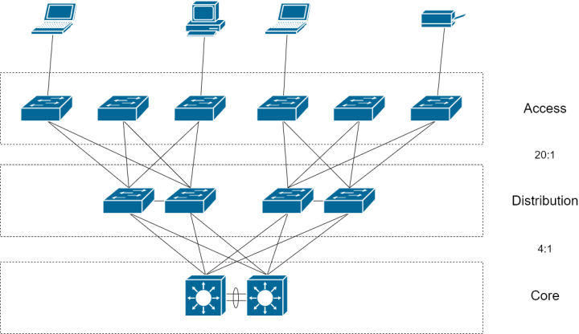
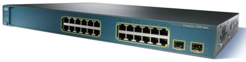
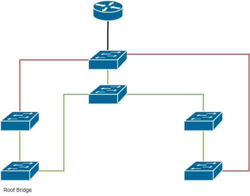
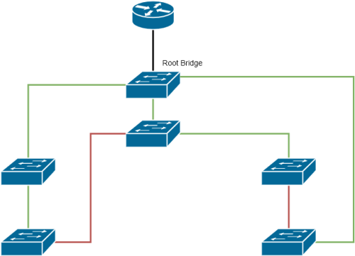

I've worked with many different organisations and I've come across a few common items when it comes to LAN switches that I though I should document in the hope it will help others.

## Oversubscription

### Network Hierarchy

Most networkers know the below diagram as the network hierarchy made up of the core, distribution and access layers. But many don't consider the oversubscription ratios when implementing the hierarchy.

Oversubscription is the aggregation ratio of the sum of the downlinks to the sum of the uplinks. The diagram below shows the recommended oversubscription ratios:

* Distribution to Core - 4:1
* Access to Distribution - 20:1

A relatively standard ratio helps maintain predictability in network performance and experience. Although I know this is hard when many businesses keep switches forever sometimes and just add to it.

### Modules

Another oversubscription that is not considered is the internal switch ratios. This is especially notable in modular switches, where the speed that the module is connected to the backplane is less than the sum of the port speeds available. 

For example the backplane speed may be 40Gbps, but the card module has 8 x 10Gbps ports. That's 160Gbps throughput (8 ports x 10Gbps x 2 input/output) giving an oversubscription of 4:1.

### Controllers

Oversubscription in fixed configuration switches is generally not too much a problem. But consider the Cisco 3560G switch - it has 32Gbps switching backplane. With the 24-port configuration it has 24 + 2 Gigabit ports, but the 48-port configuration has 48 + 4 Gigabit ports. 

Newer switches have much faster backplanes though.

Also consider network controller placement in switches. Switches often look like the picture below. The ports are not segmented for aesthetics, or to make it easy to tell port numbers, but is often an indication of how the switch controllers are placed. Ports are not usually wired to utilise a single network controller, and the ports are split up between two or more controllers. 

I would often see people wire a switch and just start from the beginning starting with one, and you may have all first 12 ports filled, but the rest empty, except for the uplink port. It's better to split the cables so 6 are in the first half and the rest are in the second half. 

## Root bridges and daisy chains

Too many places I've been where they just hook switches up as they need to without any thought about the topology. And I mean even in places with a mature IT department. I'm not a fan of daisy chaining switches - I much rather switch stacks - but I do understand them to be necessary in many cases. 

If you are deciding to daisy chain switches, especially if you are including redundant paths, ensure that you specify the root bridge in the topology. I see many places where they just install the switches and have no clue what is the root bridge.

Consider the case where switches are connected in a way where the root bridge is at the far left corner. The paths that are forwarding are shown in green and is one possible converged spanning tree.

Now consider where the main switch off the router is configured as the root bridge.

The paths to the main switch is drastically different. It doesn't look so bad in this illustration, but consider cases where there are two dozen or more switches in the topology; it can get nasty.

### Diameter issues

Another important aspect about choosing the root bridge is the diameter of the bridge network, which is how far away switches are from each other. The maximum diameter between two switches is seven hops away from each other. A switch will discard the bridge protocol data unit (BPDU) if it exceeds the diameter (in actuality the maximum age). If the root bridge is far away, then the BPDU can be discarded and the spanning tree will not converge.

Luckily, I've never seen this happen in my lifetime. And I have to say it's luck because I've seen some really wild topologies. But I have read stories, so it's one of the few reasons I shy away from daisy chains. 

### Spanning Tree load sharing

Considering the images above, note that some of the redundant paths are in a blocking state. It means those links are essentially unused. All modern switches come with Per VLAN Spanning Tree used by default, which means there is a spanning tree instance for every VLAN specified. 

This can be done by modifying the spanning tree cost of the interfaces of the switches connected to the root bridge. This way you can send some VLANs on one path, and the others on the next path. This takes some planning, and not to mention management going forward, but can have immense performance benefits considering the oversubscription points above.

