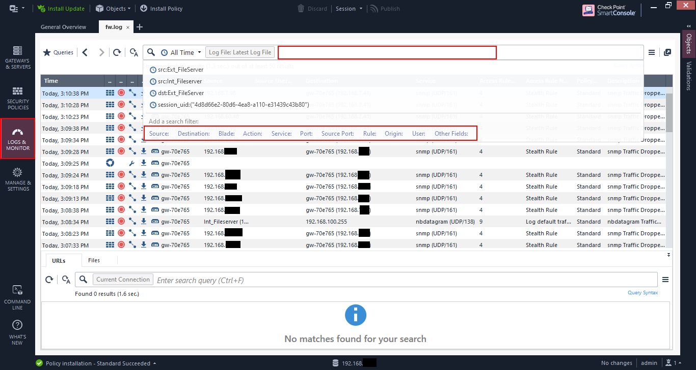
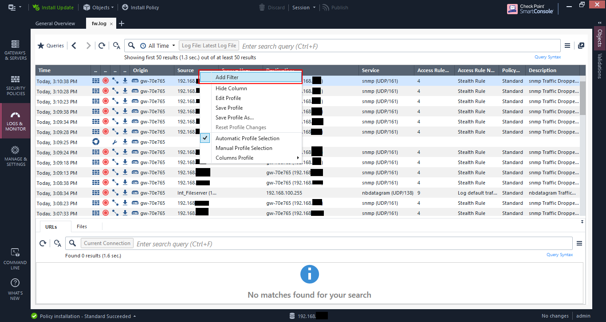
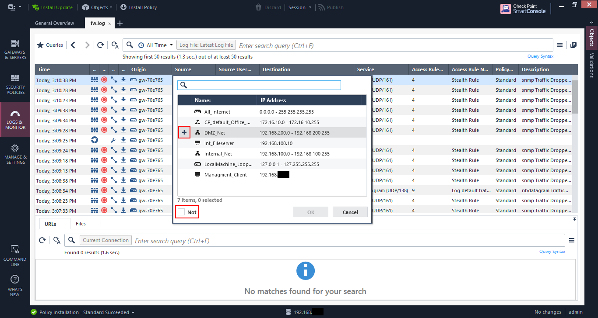
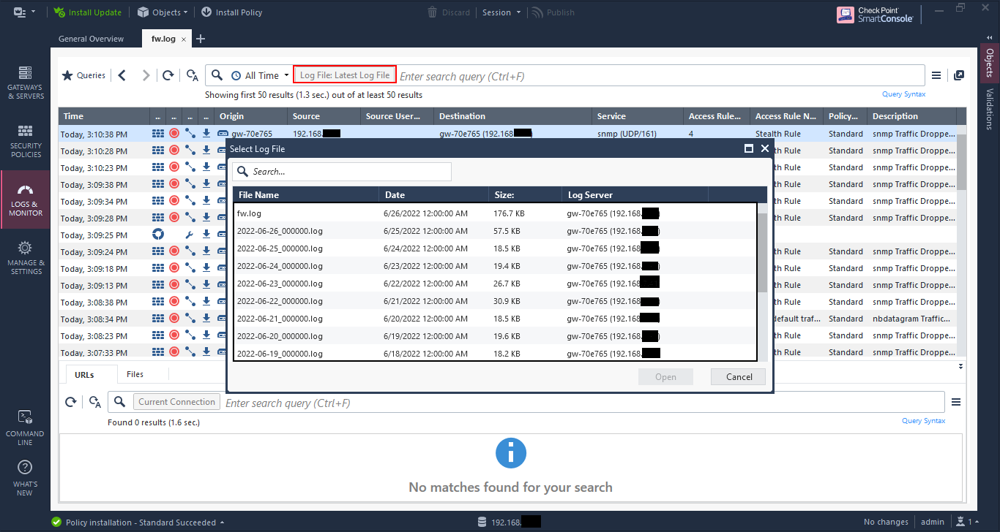
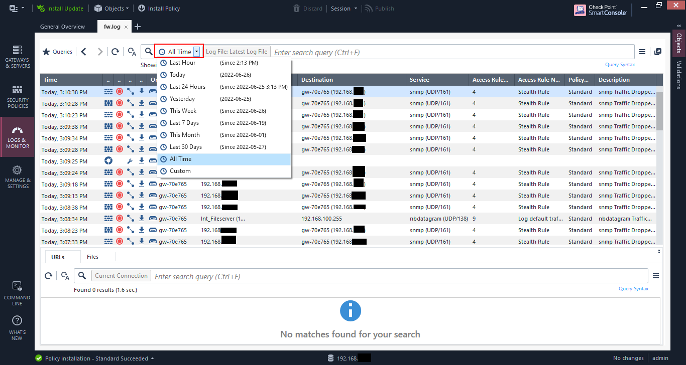
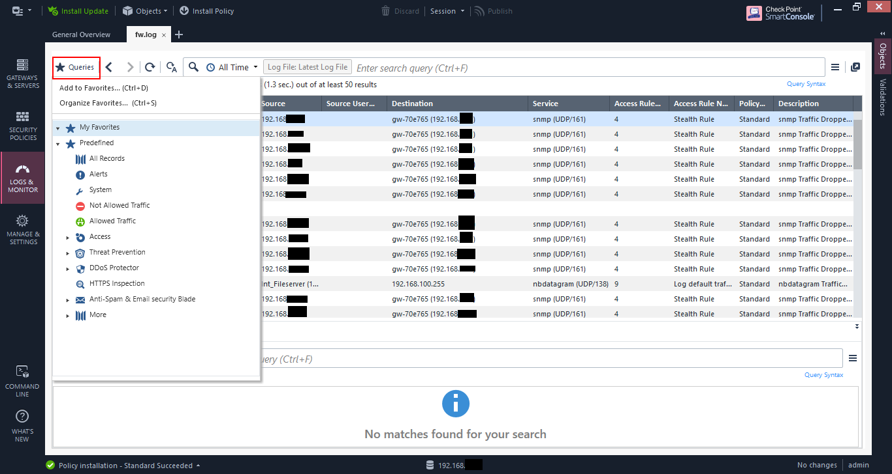
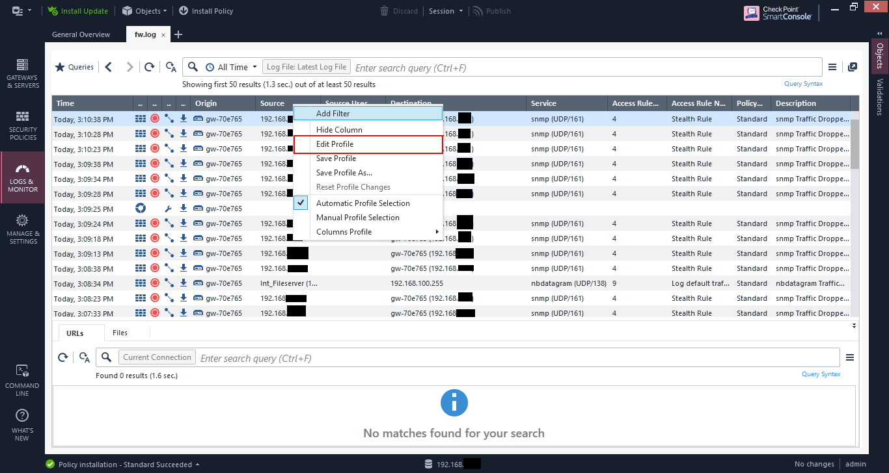
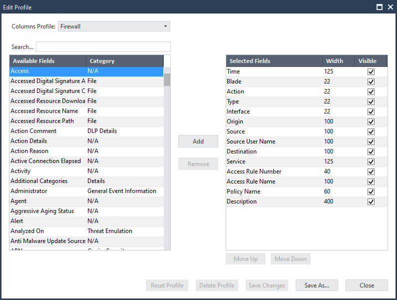
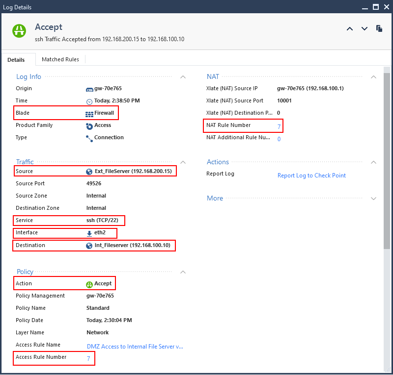
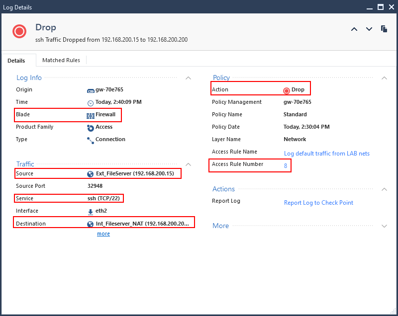

One of the best features of Check Point firewalls has always been the log viewer. The ability to filter and find logs when necessary is an important part of cybersecurity, whether it's troubleshooting an issue, or conducting and investigation.

You can access the log viewer - SmartLogs - in the SmartConsole by going to "Logs & Monitor". 

## Filtering Logs

In the log viewer you can click on the text bar at the top and you will get options to filter by.

* Source - Source host or network address.
* Destination - Destination host or network address.
* Blade - Which service caused the event - firewall, IPS, AV, etc.
* Action - Deny, Allow, Reject, VPN encrypt, etc.
* Service - Type of service.
* Port - Destination Port
* Source Port - Source Port
* Rule - A particular rule number.
* User - Username if identity is captured.

You can also filter by right-clicking on a column and selecting "Add Filter".

Then you'll get a dialog based on the column. In this case, I'm using the "Source" column. You can check multiple items. 

The "Not" option negates the selection so that the match is everything else except the selection.  

## Opening other saved logs

If you have any saved logs, or you have automatic rollover like I have, you can open the other logs by clicking on "Log File". You will get a list of all the logs that are available to open.

## Filter by time

If you have a log over a long period of time, you can filter using the drop down and choose your duration. 

## Saved queries

If you have queries that you run often, you can save them using the "Queries" button. 

## View profiles

Often I like to modify the log view so that I can have the information I want to see immediately. RIght-click on the column headings and click "Edit Profile".

You get a box that allows you to choose the columns you want to see. I tend to use the "Xlates" and "VPN" columns a lot when I'm trying troubleshoot issues. 

Even if the columns are not in the view, you can always double-click a log item to open it to see the details of the entry.

I've highlighted some main items, but two helpful items are:

* Access Rule Number
* NAT Rule Number

If you click on those numbers it takes you directly to the rules that were matched. In complex rulebases these are lifesaver. 

Check Point's log viewer is the best among other firewalls out there. Hopefully, this little guide has helped you understand some of it better.
