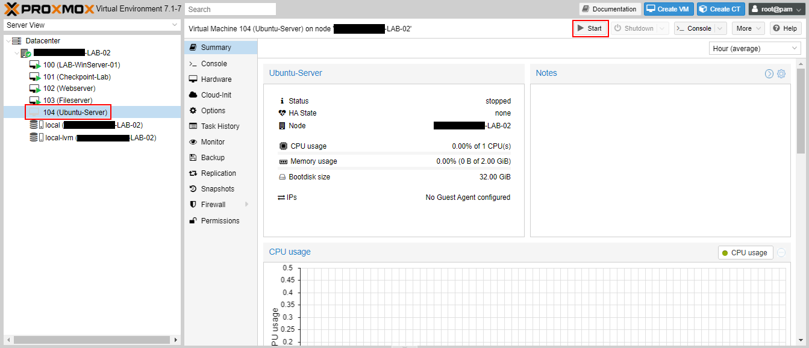
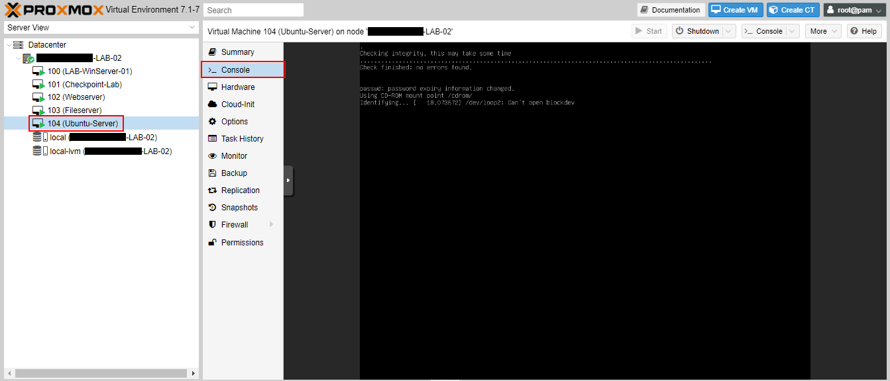

Now that Proxmox is running and the virtual networks are setup, let's now spin up some virtual instances. We'll look at create standard Virtual Machines and then Linux Containers.

## Creating a Virtual Machine

At the top right-hand corner, select "Create VM".

The "Create: Virtual Machine" wizard will show up. Give your VM a name. 

Next, select an ISO image to boot from, or you can use physical media if you're really old school. 

I'm using Ubuntu 20.04 LTS. 

I generally keep the system settings default, but you can change these settings depending on the OS you're using, like if they're older. 

Set your Disks next. Specify the storage location, which is usually either an LVM or LVM-Thin location. Set your Disk size as well depending on the minimum requirements of the OS. 

Choose your CPU settings depending on the minimum requirements of the OS. A socket is a processor, and the cores define the number of cores per processor. This is virtualised, but sockets x cores count must not exceed the total number of sockets x cores you have on your physical machine.

Specify the amount of memory required for the OS. The total amount of memory per system should not exceed the amount of physical memory available on the node, less the memory required to run Proxmox itself. 

Specify the network to be used. Here I'm using the `vmbr10` interface. 

Confirm your settings. You can choose to start the VM now by checking the "Start after created" box, but we'll just click "Finish" for now.

Once the VM is created, you can select it on the left-hand pane, and then click "Start" at the top right-hand corner.

Select "Console" in the settings pane to view the machine display. You now have a working VM. Once it's fully booted, you can log in and configure the settings.

## Creating a Linux Container

I briefly [discussed containers in the overview of Proxmox](https://essgeelabs.com/posts/home-lab-with-proxmox/#container-templates). Here we will create one. Remember that containers will only be Linux-based. 

At the top right-hand side, click on "Create CT".

A wizard similar to the VM creation wizard will appear. The dialogue is similar, but you will notice some differences.

In the "General" settings specify the "Hostname", which will be set at the hostname of your VM.  Also specify the password, which will be the password of the root account. You can also add an SSH public key that will allow you to access the machine using key-based authentication, but we'll just set the password for now.

Next choose a container template. I'm going to use the WordPress one.

Specify the disk size and storage location. Remember that containers are lightweight and don't need as much storage as a full VM, since it shares the kernel with the host. So the storage is mainly for the user files on the system.

Specify the number of cores. Notice that there is no socket option here as we're specifying how many cores we're going to make available to the container.

Next specify the memory required. Again, for a container, we can use a small memory size. 

You'll notice that the network section allows many settings to be entered. Specify the virtual network for the container, also specify the IP address and prefix length. 

Then specify the DNS settings. I'm using Google's DNS.

Review your settings and click "Finish".

Select the new container you created in the left-hand pane, and then click "Start" at the top right-hand corner.

Like VMs, you can access the console by going to "Console" in the VM settings pane.

## Viewing and Changing settings of a VM

Once you've created a VM, you can always see a summary and the settings by using the Settings pane for the machine. Here we can see a summary of the Windows Server host that I created. 

To change any hardware setting, such as changing the network that it's connected to, go to the "Hardware" setting and edit the "Network Device". Some settings such as the Network Device can be changed while the VM is running, others such as memory and processors need the system to be turned off or rebooted.

## Connecting a VM to a VLAN on a Trunk port

Remember [in the last post](https://essgeelabs.com/posts/virtual-networking-within-proxmox/#trunk-ports) that we created `vmbr1` as a trunk port. If I wanted to add my VM to connect to VLAN 101 on that port, I would select the "Bridge" as `vmbr1` and the "VLAN Tag" as `101`. Now that machine can communicate with the physical network once I add an IP in that network range.

## Conclusion

You now know enough to configure your own Proxmox system and start your virtual instances. Build your lab and remember to have fun.

Let me know of your experiences.
