In my [last post I gave a brief overview of Proxmox](https://essgeelabs.com/posts/home-lab-with-proxmox/). You can go ahead and start launching VMs now if you wish, but if you're building a LAB then you want to have machines talk to each other separately from your main network. This is best if you plan to do some security stuff and may have malware or vulnerable machines in there. 

To do this you'll need to create virtual networks. Virtual networks are not connected to the main network and allow all the machines connected to a virtual network to communicate with each other. You can also communicate with the host server if you wish by providing an IP address. In my case I didn't do this as I used a virtual firewall to provide connectivity to each network.

## Getting started

To get started, first go to the network settings on the Proxmox node.

My node has two onboard network adaptors seen in the below as `eno1` and `eno2`. If you have only one you will only see one. 

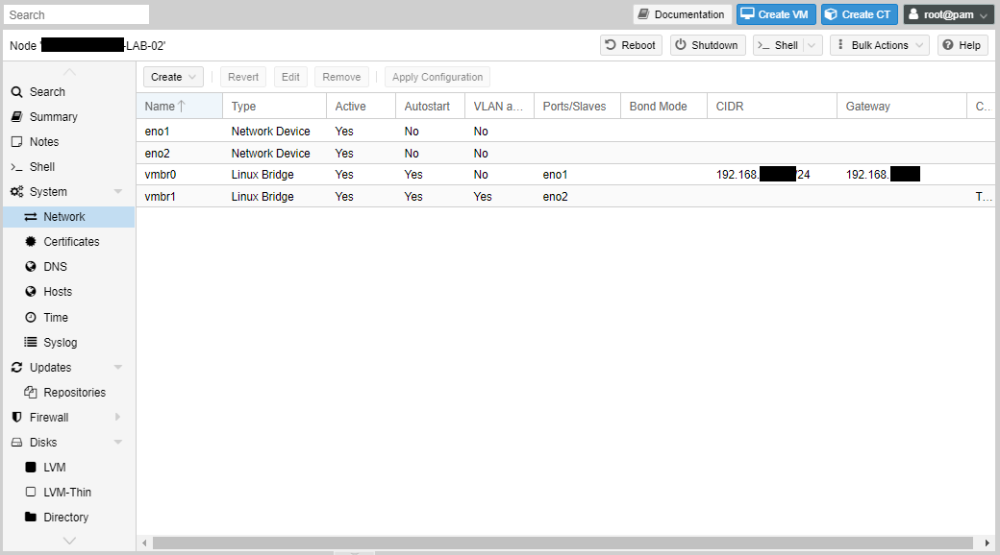

Proxmox create bridged interfaces for its virtual networking. `vmbr0` is the one automatically created at setup when you were asked to provide an IP address for the node. If you edit that interface you will see that it's tied to `eno1` and you can change it here if you wish, including the IP address of the node.

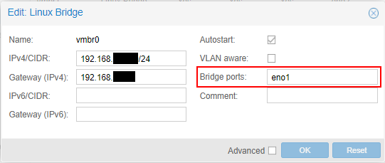


## Trunk Ports

I tend to leave the `vmbr0` interface separate for management and then configure the next physical interface to connect the virtual instances if they need to access the physical network. This is the `vmbr1` interface as shown below. I've also configured this as a trunk port by checking the "VLAN aware" box. This means that it will send and recognised 802.1q VLAN tags. You will need to connect that port to a switch port configured as an 802.1q trunk. 

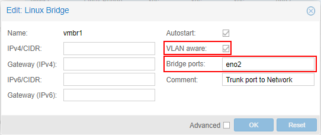

## Creating virtual networks for your VMs

To create virtual networks separate from the physical network you create bridges. To start click "Create" then select "Linux Bridge".

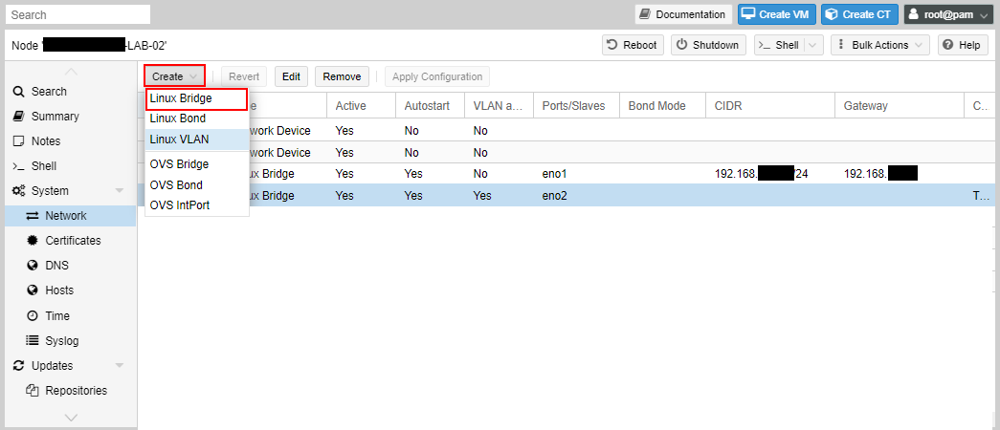


Give the bridge a name. I chose `vmbr10` to represent the 192.168.10.0/24 network, and `vmbr100` to represent the 192.168.100.0/24 network. But you can decide your own convention. 

You don't need to provide an IP address here. This is only if you want to give the node an IP address on that network. If you don't want your VMs to communicate with the node itself, then don't enter an IP address here.

Once set you can now proceed to create VMs and assign to the network. We'll go through than in the next tutorial.

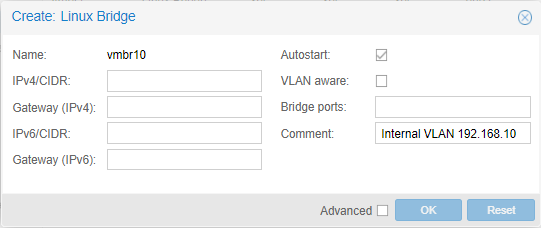


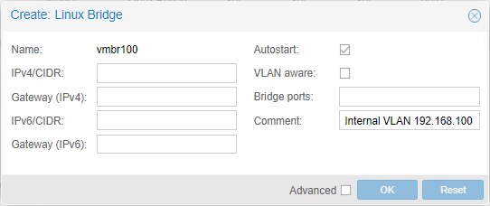

## VLAN interfaces

If you want your host node to communicate with other VLANs in the physical network, you can create VLAN interfaces. There are few cases you may want  to do this, but I'll still show you the process. These interfaces cannot be assigned to virtual machines, and it's only to communicate with the node.

Click "Create" and then "Linux VLAN".

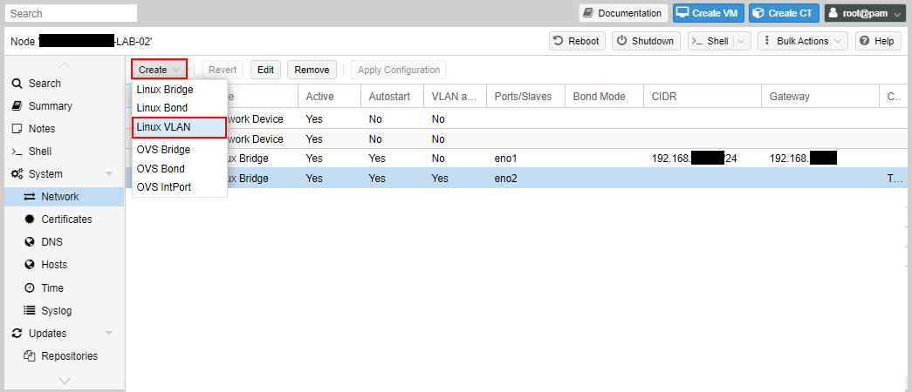

In the dialog box you will enter the name as an existing interface with the sub-interface (VLAN) ID, or use the name as VLANxxx, where xxx is the VLAN ID and set the VLAN raw device as the existing interface.

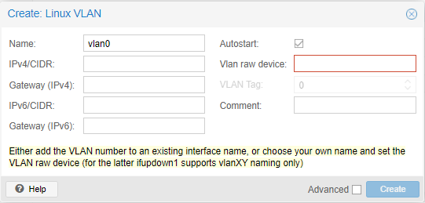

For example, using `vmbr1`, which is VLAN aware, we set the name as `vmbr1.101`, which sets the existing interface to `vmbr1` and the VLAN as 101. 

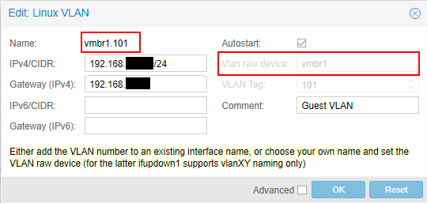

## NAT interfaces

One of the features that I liked about VMWare workstation is that it comes with a NAT interface. It's where I can assign the VM to that network and it would access the physical network using the IP address of the host. It will hide behind the host's IP address to access external resources.

The same can be done with Proxmox, but not via the Web GUI. You'll have to do some shell editing for this.

Click on "Shell" and a shell interface will pop out.

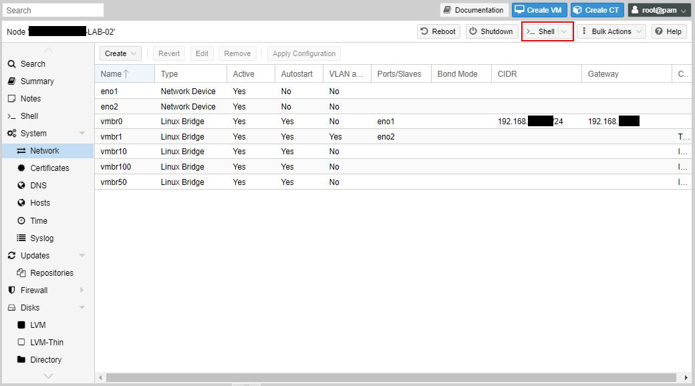


At the command-line type:

`nano /etc/network/interfaces`

Scroll to the bottom and add the following:

```
auto vmbr999
iface vmbr999 inet static
        address 192.168.254.1/24
        bridge-ports none
        bridge-stp off
        bridge-fd 0
        post-up echo 1 &gt; /proc/sys/net/ipv4/ip_forward
        post-up   iptables -t nat -A POSTROUTING -s '192.168.254.0/24' -o vmbr0 -j MASQUERADE
        post-down iptables -t nat -D POSTROUTING -s '192.168.254.0/24' -o vmbr0 -j MASQUERADE
#NAT Bridge
```

`vmbr999` is the name I chose, but you can choose differently.

The IP address "192.168.254.1/24" is going the be the IP address of the node, and this will be set as the default gateway of the VMs that you assign to the network.

The first `post-up` enables IP forwarding allows the node to route traffic between interfaces. The second `post-up` enables the NAT. These are run when the interface comes up. The `post-down` is run when the interface is brought down and deletes the NAT.

Once you've entered the settings, enter `control-o` to save, then `control-x` to exit.

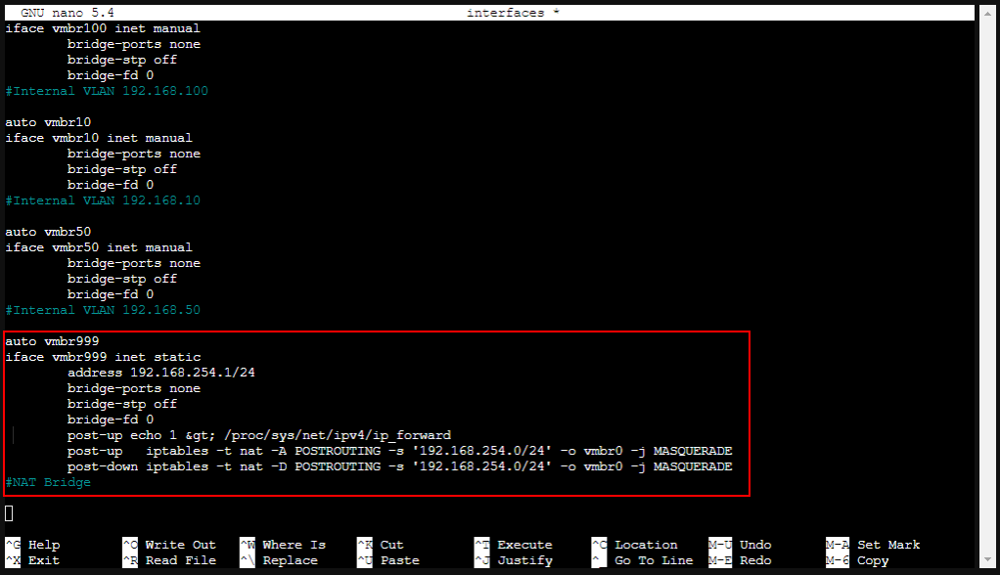


Now type:

`service networking restart` 

This restarts the networking service and will temporarily disrupt network connectivity to the node and VMs.

The interface will be visible in the Web GUI, but you can't change the settings that were entered in the config file. 

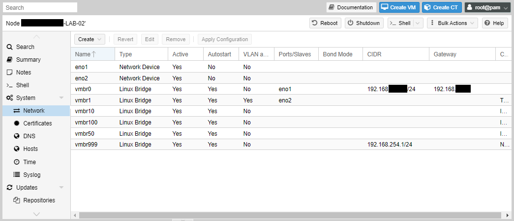


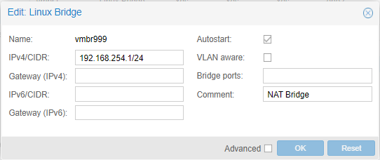

## Next steps

Now that virtual networks have been created, we'll move on next to creating our virtual machines.
